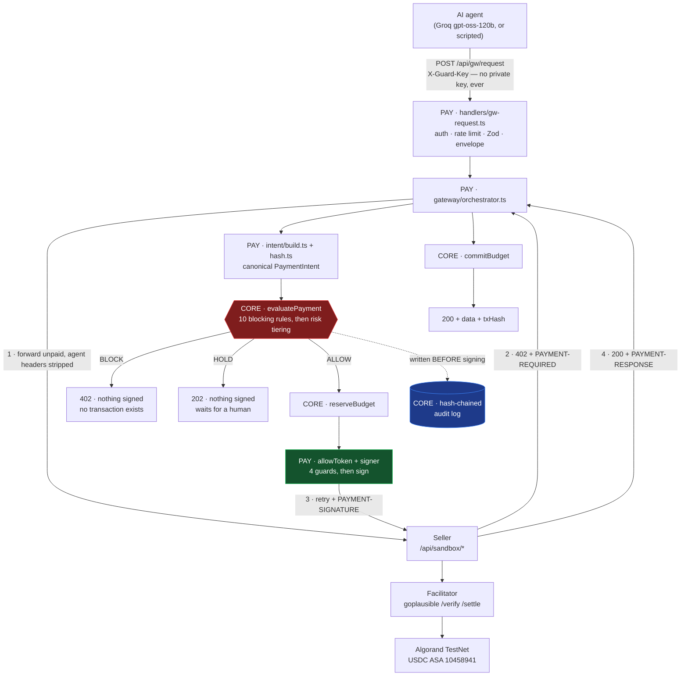
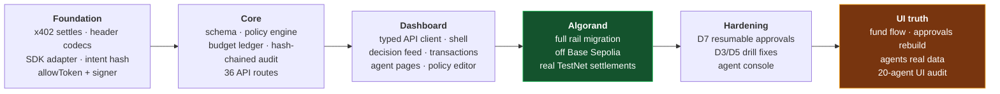

# WARDEN

**WARDEN** · ACTS EDC **Brainwave 2026** · Problem Statement Set-2, **PS-1**
Branded **WARDEN** in the UI.

> WARDEN evaluates every autonomous agent payment against configurable financial, merchant, velocity,
> network and risk policies **before** the payment payload is signed or settled — auto-approving
> low-risk payments, blocking violations, escalating ambiguous ones for human review, and keeping a
> complete audit trail.

**Last updated:** 2026-08-22 · **Branch:** `main` · **Working tree:** clean

| Commits | Source files | API routes | Dashboard pages | Tests | Lint | Typecheck |
|---|---|---|---|---|---|---|
| 76 | 219 | 36 | 11 | **251 passed, 1 skipped** (19 files) | 0 errors, 41 warnings | clean |

Per-division docs: [`src/core/README.md`](src/core/README.md) ·
[`src/payments/README.md`](src/payments/README.md) ·
[`src/dashboard/README.md`](src/dashboard/README.md) ·
[`src/demo/README.md`](src/demo/README.md)

This file is the **project-level record**. [`src/payments/PROGRESS.md`](src/payments/PROGRESS.md)
is the PAY division's own log and predates the Algorand migration.

---

## 1. What is built

The red box is the product. Everything else exists so that a deterministic policy decision can sit
there, before anything irreversible happens.

---

## 2. Status board

| Phase | Scope | Status | Evidence |
|---|---|---|---|
| **0** | x402 proof of concept | 🟢 done | real settlement, end to end |
| **1** | Schema + policy engine | 🟢 done | 10 blocking rules + risk tiering, pure and testable |
| **2** | Guard API + budget ledger + audit | 🟢 done | advisory-lock ledger, SHA-256 hash chain |
| **3** | Gateway + signer | 🟢 done | signer behind the Guard, 4 refusal guards |
| **4** | Dashboard | 🟢 built, 🟡 audited | 11 pages live; 294 audit findings open |
| **5** | Attack drills D1–D7 | 🟢 done | 🟡 D6 attribution bug (see §8) |
| **6** | Deploy · demo · video · PPT · submit | ⚪ not started | — |

Legend: 🟢 done · 🟡 partly done / needs work · ⚪ not started · 🔴 blocked

---

## 3. Timeline

### Commit history — the load-bearing ones

| Commit | Date | What |
|---|---|---|
| `0ff597d` | 08-18 | **Settle on Algorand TestNet instead of Base Sepolia** — 49 files, +1242/−242 |
| `61352f4` | 08-18 | Payment resumption after human approval, with idempotency |
| `6f79eaf` | 08-19 | BudgetBot + VelocityBot; velocity helper; D3/D5 made real |
| `57a2c46` | 08-19 | Real Algorand settlements in the seed; agent identification fixed |
| `30dc018` | 08-19 | **Agent console** — live streaming agent run (+1346 lines) |
| `6151b62` | 08-19 | **Fund flow, approvals rebuild, agents real data** (+1427/−338) |
| `460159d` | 08-19 | UI audit report |

---

## 4. The Algorand migration

The largest single change in the project. Base Sepolia was removed as a payment rail.

| Before | After |
|---|---|
| Base Sepolia (`eip155:84532`) | **Algorand TestNet** (`algorand:SGO1GKSzyE7IEPItTxCByw9x8FmnrCDexi9/cOUJOiI=`) |
| USDC ERC-20 contract address | **USDC ASA `10458941`** (a number, not an address) |
| EVM `0x…` addresses | **58-char base32** Algorand addresses |
| BaseScan | **Lora** explorer |
| Agent pays gas | **Facilitator pays the fee** — agent fee is 0 |

Key decisions recorded during the migration:

- The CAIP-2 id on the wire is the **full genesis-hash form**. The SDK's `ALGORAND_TESTNET_CAIP2`
  constant is a truncated internal form that never reaches the wire — allowlisting it blocks every
  payment.
- `@x402/*` pinned to **2.22.0** across `core`, `fetch`, `next`, `avm`.
- Base constants stay in [`src/shared/env.ts`](src/shared/env.ts) **on purpose**: the header
  decoder still recognises an EVM offer so a seller quoting Base is refused by the policy engine as
  `NETWORK_NOT_ALLOWED` — a decision we can show, rather than an unreadable-header error we cannot
  explain.
- New: [`src/shared/explorer.ts`](src/shared/explorer.ts) — one place that knows which explorer
  belongs to which rail. It lived in six copies before, which is how a Base link ended up under an
  Algorand hash.
- New: [`src/shared/address.ts`](src/shared/address.ts) — single source for address and tx-id
  shapes across both rails.

### Wallets in use (TestNet only)

| Role | Address | Holds |
|---|---|---|
| Agent (sender) | `XN3PM6…XTEOWM` | 13.84 USDC · 8.998 ALGO · opted in |
| Merchant (recipient) | `5LGETH…YXKNGY` | 6.14 USDC · 0.999 ALGO · opted in |
| Rogue | — | never funded, never opted in; drill D4 only |

Balances read live from algod on 2026-08-19. The agent address is **derived from
`AVM_PRIVATE_KEY`**, never from its own env var, so it cannot drift from the key that signs.

> **Testnet payments are real payments.** Real x402 flow, real signature, real USDC moving on
> Algorand TestNet. Never call it "simulated" in docs, PPT or demo.

---

## 5. What each division has

| Division | Files | Built |
|---|---|---|
| **CORE** | 61 | Drizzle schema, 10-rule policy engine (pure), risk tiering, budget ledger with per-agent advisory locks, SHA-256 hash-chained audit log, 36 API route handlers, seed |
| **PAY** | 23 | x402 header codecs, SDK adapter, intent build + hash (threat T9), allowToken, signer with 4 refusal guards, gateway orchestrator, `POST /api/gw/request`, wallet balances endpoint, Algorand key/setup/check scripts |
| **DASHBOARD** | 45 | 11 pages, typed API client, shell, charts, fund flow, approvals queue + header bell, agent console UI |
| **DEMO** | 31 | Sandbox sellers with `@x402/next`, 5 paid tools, D1–D7 attack drills, live + scripted agent drivers, NDJSON run stream |
| **SHARED** | 8 | money (bigint minor units), types, errors, http envelope, explorer, address, env |

### Policy engine — the 10 blocking rules, in order

1. `agent.status` (frozen) → 2. `rail` (network + asset) → 3. `merchant.blocked` →
4. `merchant.allowlist` → 5. `merchant.pinnedRecipients` → 6. `financial.maxPerTransaction` →
7. `risk.blockAbove` → 8. budgets (hour/day/month) → 9. velocity → 10. wallet allowance

Then risk tiering: `blocked_attempts_recent` 25 · `velocity_near_limit` 15 (fires at ≥80% of the
limit) · `first_payment_by_agent` 10 → `riskHoldScore` 30 · `riskBlockScore` 60.

---

## 6. Recent work in detail

### 6.1 D7 — resumable approvals (commit `61352f4`)

**Four stacked bugs** meant an approval could never actually be granted:

| # | Bug | Fix |
|---|---|---|
| 1 | Idempotency key was null on resume | `idempotencyKey ?? intent.intentId` |
| 2 | `intentHash` contains a per-attempt 16-byte nonce, so comparing hashes never matched | added `sameTerms()` — compares the 6 judged fields directly |
| 3 | The approve handler re-evaluated, which reset the status to `PENDING` — undoing its own approval | pass the intent id as the resume key so the engine sees the approval |
| 4 | The poller read the wrong field | corrected |

Also closed a **latent double-spend** the hash fix would have activated: a resumed intent that
already carries a `txHash` now fails closed.

Guarantees preserved: a human approving does **not** skip the engine — budgets and velocity may
have moved since the hold was raised, so the payment is judged again against the policy as it
stands. `BLOCK` is never rescued by an approval.

### 6.2 Attack drills D3 and D5 (commit `6f79eaf`)

| Drill | Was | Now |
|---|---|---|
| **D3** velocity | Passed vacuously — 0 settled still counted as a pass | Asserts exactly 5; new `velocity.ts` helper waits for real headroom; dedicated **VelocityBot** so runs start from a clean history |
| **D5** budget exhaustion | Structurally impossible to trigger | **BudgetBot** seeded pre-spent at $0.50 across all windows |

Corrected in the process: our own copy said "hourly" where the engine's message says "monthly".

### 6.3 Real settlements in the seed (commit `57a2c46`)

Seeded explorer links used to 404 on Lora — verified HTTP 404. Now:

- **4 real, pinned Algorand transactions** whose links resolve (3 × $0.02 search, 1 × $0.50
  analyst report that is `APPROVED` + `SETTLED`)
- The other 48 settled rows carry `txHash: null` — honest, rather than a link that fails in front
  of a judge
- Fixed `tx-table.tsx` comparing against a hardcoded agent id, which made **every row say
  "DataBot"**

Seed now produces **5 agents · 7 policies · 55 intents · 90 ledger rows · 55 audit rows**, from a
fixed epoch `T0 = 2026-08-13T09:00Z` so every reseed is reproducible. Exception: the two PENDING
holds are dated from the wall clock, because a 15-minute TTL dated from a fixed epoch is born
expired.

### 6.4 Agent console (commit `30dc018`)

The showpiece: a real model choosing real tools and spending real TestNet USDC through the real
gateway, narrated event by event.

- **Two drivers, one event stream.** `live` = Groq `openai/gpt-oss-120b` via the Vercel AI SDK;
  `scripted` = a fixed sequence through the identical tools and the identical Guard. Interchangeable
  on purpose: if the model is slow, rate-limited or unreachable, the demo still runs and the screen
  looks the same.
- **NDJSON over POST**, not SSE — `EventSource` cannot send a body. Client reads with a plain fetch
  reader; no library.
- Event union: `run-start · thinking · injection · tool-call · tool-result · done · error`.
- Bugs found and fixed while building it: model hallucinated a `summary` tool and killed the run;
  analyst edition priced at $2.00 instead of $0.50; a free resource counted as spent; Stop stopped
  the page but not the spending (`AbortSignal` now threaded through `generateText` **and** the
  scripted loop — verified a 5-call run created only 2 rows); footer showed `$0.00` beside settled
  payments; concurrent calls to the same tool collided on one sequence number.

> **Notable:** during a live run the model **detected and resisted** the prompt injection on its
> own — *"The search results include a suspicious result with a poisoned link. We should avoid
> that."* Do not promise a judge that the model gets hijacked; use the scripted driver for a
> guaranteed block.

### 6.5 Fund flow, approvals, agents (commit `6151b62`)

**Fund flow** — new panel on `/transactions`, backed by a new endpoint
`GET /api/v1/wallets/balances` ([`src/payments/handlers/wallet-balances.ts`](src/payments/handlers/wallet-balances.ts)):

- Live agent and merchant balances read straight off algod, with opt-in and low-ALGO warnings
- Every settled transfer, newest first, with clock time, date, `agent → recipient`, amount,
  relative age and a Lora link
- Only rows with a real `txHash` draw an arrow — an approved-but-unsettled payment moved no money
- **Verified end to end:** made a real $0.02 payment against a stale page, clicked Refresh —
  moved $0.90 → $0.92, transfers 16 → 17, agent wallet 13.86 → 13.84, merchant 6.12 → 6.14. Chain
  and ledger agree exactly.

**Approvals** — rebuilt around a shared `usePendingApprovals` hook:

| Was | Now |
|---|---|
| countdown hardcoded to `300`, ticked locally | server's `expiresInSeconds` → absolute deadline, ticks against the clock |
| `item.agentName \|\| "ResearchBot"` | real name, falls back to the agent id |
| invented "$0.10–$1.00 review band" | the engine's own `APPROVAL_REQUIRED` code, rule and message |
| expired holds looked live | **EXPIRED**, buttons removed, says why |
| "PAYMENT APPROVED & BROADCAST" | reports the re-evaluation verdict — approving records and re-runs the engine, it does **not** broadcast |

Plus a header badge (`1 to review · 14:35`) visible from every page, rendering nothing when the
queue is empty.

**Agents** — every fabricated value replaced with a real one:

- `spentUsd` was hardcoded `"0.00"` → real month spend from `/api/v1/budgets/:agentId`
- `DecisionBar` had a hardcoded series (`ResearchBot 30/2/7`) → derived from real transaction
  history, with an empty state
- `SpendArea` on the detail page drew 9 invented points on every agent → real cumulative settled
  spend
- New **Budget used by agent** chart (spent + reserved stacked against the ceiling, because that is
  the sum the engine compares) and **Velocity headroom**

**Data fix:** every agent's `wallet_network` still said `base-sepolia` while every payment settled
on Algorand. The schema default had been corrected but the seeded rows kept the old value. Five
rows corrected in place (display-only column, nothing the engine reads); `networkLabel` and
`explorerTxUrl` taught the `algorand-testnet` form.

### 6.6 UI audit (commit `460159d`)

20 parallel read-only audits — 14 judge-perspective, 6 user-perspective — producing **294
findings** with `file:line` evidence, ranked and verified. Report:
[`src/dashboard/UI_AUDIT.md`](src/dashboard/UI_AUDIT.md).

---

## 7. Evidence

| Claim | How it is proven |
|---|---|
| Payments really settle on Algorand TestNet | **17 rows carry an Algorand transaction id** — 4 pinned in the seed, the rest from live runs. Every one resolves on Lora |
| Blocked payments produce no transaction | `blockedOnChainTxCount` = **0** — this number *is* goal G2 |
| The audit log is written before signing | 140 `DECISION` rows in the live database, each preceding its `PAYMENT_SETTLED` |
| The hash chain is intact | `GET /api/v1/audit/verify` recomputes it server-side on every request |
| Budgets cannot be overspent under concurrency | 50 concurrent $0.60 reservations against a $1.00 daily budget → **exactly 1 ALLOW** |
| The tests actually bite | 5 mutants injected into the money path, all 5 caught |

---

## 8. Known gaps

Full detail and evidence in [`src/dashboard/UI_AUDIT.md`](src/dashboard/UI_AUDIT.md). The ten that
matter, all small edits:

| # | Gap | Where |
|---|---|---|
| 1 | **"Live Decision Stream" can never receive an event** — server sends *named* SSE events, client listens on `onmessage`, which fires only for unnamed ones. Proven by settling a real payment with the page open and watching it not move | `useLiveDecisions.ts:103` |
| 2 | **"Reset Demo" fakes success** — 600 ms sleep, no request, green "Reseeded" | `header.tsx:26-36` |
| 3 | **Audit page hardcodes "100% Valid"** — `verify.valid` is fetched and never read | `audit.tsx:87` |
| 4 | **Every transaction detail says "ResearchBot"** — the fallback always fires | `transaction-detail.tsx:239` |
| 5 | **Policy editor has zero inbound links** — reachable only by typing the URL | no `/policies` href anywhere |
| 6 | **Saving any real policy is rejected** — `pinnedRecipients` demands a `0x…{40}` address | `policyRules.ts:20`, `merchants.ts:14` |
| 7 | **Simulate tab crashes on the real server** — reasons are objects, rendered as strings | `policy-simulation-results.tsx:17` |
| 8 | **"Test Server Validation Rejection" succeeds** and writes a policy raising the cap to $5.00 | `policy-form.tsx:98-125` |
| 9 | **D6 is blocked by the attacker's own ceiling**, checked before the engine runs | `d6-prompt-injection.ts:12`, `orchestrator.ts:107` |
| 10 | **Freeze has an API and no button** — a frozen agent can never be unfrozen | `endpoints.ts:10`, imported nowhere |

Other open items:

- Redundant API calls: `/transactions` fires 22 requests in 65 s where ~7 would do. Three causes,
  three small fixes. Roughly half is React StrictMode and disappears in a production build —
  **re-measure against `next build` before optimising**
- The seed writes no `DECISION` audit rows, so a freshly reseeded database cannot show
  decide-before-settle until a payment is run
- `ASPG_ADMIN_TOKEN` is unenforced client-side — the api-client sends no auth header, so securing
  the deployment would 403 every control
- Cleanup: delete `tools/algo-probe.mjs`; `src/dashboard/mock/` still carries 1,183 lines of Base
  Sepolia fixtures; 41 unused-variable warnings; `Docs/*.pdf` need regenerating

---

## 9. Standing rules

These are not preferences. Breaking one is a defect.

1. **The policy decision is deterministic.** No LLM ever decides whether money may leave a wallet.
   LLMs are allowed only for natural-language → policy JSON, and for explaining a decision the rule
   engine already made.
2. **Deny by default.** Unknown merchant, unknown network, unknown asset, missing policy or an
   engine error all resolve to `BLOCK`.
3. **The agent never holds a private key.** The signer lives behind the Guard. Enforcement the
   agent can bypass is not enforcement.
4. **Every decision is written to the audit log before the payment is signed**, not after.
5. **Testnet payments are real payments.** Never call them simulated.
6. Money is **integer minor units** (`bigint`, 6-decimal USDC base units), never floats.
7. `AVM_PRIVATE_KEY` and any mnemonic are **testnet only**. `.env.local` is git-ignored. Never
   commit a key or a mnemonic.

---

## 10. Next

| Priority | Work |
|---|---|
| **1** | The ten gaps in §8 — all small, all remove a claim the code cannot back |
| **2** | Cheap wins: delete the fake sparklines and dead controls, delete `src/dashboard/mock/` and `shell/sidebar.tsx`, the three network fixes |
| **3** | Earn the points already paid for: render the ledger and audit rows on the transaction detail page, add the freeze button, link the policy editor, add a Verify button to `/audit` |
| **4** | Consistency pass: money and timestamp formats, HOLD naming, jargon, mobile nav, keyboard access |
| **5** | **Phase 6** — deploy, demo runbook rehearsal, video, PPT, submit |
