<div align="center">

# 🛡️ WARDEN
### Agent Spend Policy Guard (ASPG)

**A policy-enforcement gateway for x402 autonomous agent payments**

Built for ACTS EDC **Brainwave 2026** · Problem Statement Set-2 · **PS-1**


</div>

<br/>

> ### 💬 The one sentence this project is judged on
> ### *"The agent tried to spend $2. The Guard refused. The blockchain has no record of the attempt."*

<br/>

## ⚡ At a Glance

| | |
|---|---|
| 🧠 **Policy Engine** | 10 rules + 7-signal risk score · **deterministic, zero LLM** |
| 🔑 **Key Custody** | Agent never touches a private key — signer lives behind the Guard |
| ⛓️ **Settlement** | Real USDC on Algorand TestNet (ASA `10458941`) — never "simulated" |
| 📋 **Audit Trail** | SHA-256 hash-chained, written **before** signing, tamper-evident |
| 🚫 **Default Posture** | Deny-by-default — unknown merchant/network/asset → `BLOCK` |
| 💰 **Money Type** | Always `bigint` minor units — never a float |

<br/>

---

## 🌊 How It Works

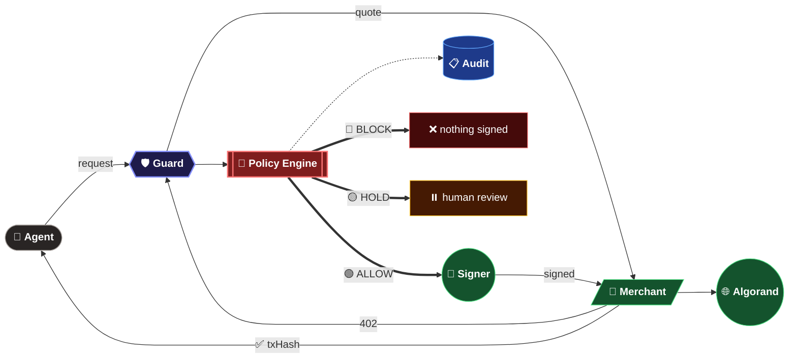

<br/>

## 🧩 Module Map

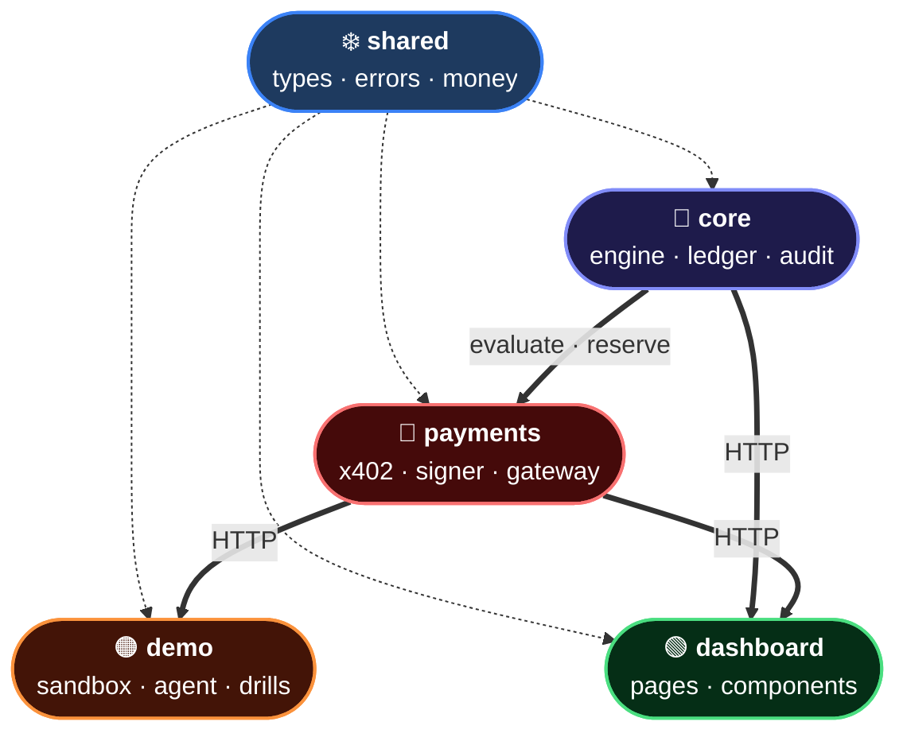

<br/>

## 🔁 Payment Flow

```mermaid
sequenceDiagram
    autonumber
    actor Agent as 🤖 Agent
    participant Guard as 🛡️ Guard
    participant Core as 🧠 Engine
    participant Seller as 🏪 Merchant
    participant Chain as 🌐 Algorand

    Agent->>Guard: request
    Guard->>Seller: forward
    Seller-->>Guard: 402 payment required
    Guard->>Core: evaluate()
    Core-->>Core: 📋 write audit row

    rect rgb(69, 10, 10)
    Core-->>Guard: 🔴 BLOCK
    Guard-->>Agent: 402 · nothing signed
    end

    rect rgb(69, 26, 3)
    Core-->>Guard: 🟡 HOLD
    Guard-->>Agent: 202 · awaiting human
    end

    rect rgb(20, 83, 45)
    Core-->>Guard: 🟢 ALLOW
    Guard->>Guard: 🔑 sign payload
    Guard->>Seller: retry + signature
    Seller->>Chain: settle USDC
    Chain-->>Seller: txHash
    Seller-->>Agent: 200 · txHash
    end
```

<br/>

## 🌳 Policy Engine — 10 Gates, First Block Wins

```mermaid
flowchart TD
    START(["📥 New Payment"])
    GATES{{"🚧 <b>10 Sequential Gates</b><br/><br/>1️⃣ agent active<br/>2️⃣ network + asset allowed<br/>3️⃣ merchant not blocked<br/>4️⃣ merchant allowlisted<br/>5️⃣ recipient pinned<br/>6️⃣ per-tx limit<br/>7️⃣ absolute ceiling<br/>8️⃣ budget window<br/>9️⃣ velocity<br/>🔟 wallet allowance"})
    RISK{{"🎯 <b>Risk Score 0-100</b>"}}
    ALLOW(["🟢 ALLOW"])
    HOLD(["🟡 HOLD"])
    BLOCK(["🔴 BLOCK"])

    START --> GATES
    GATES -- "❌ any gate fails" --> BLOCK
    GATES -- "✅ all pass" --> RISK
    RISK -- "≥ 60" --> BLOCK
    RISK -- "30 – 59" --> HOLD
    RISK -- "< 30" --> ALLOW
    START -.->|"⚠️ exception / no policy"| BLOCK

    classDef start fill:#1e3a8a,stroke:#60a5fa,color:#fff
    classDef gate fill:#1c1917,stroke:#a8a29e,color:#fff,text-align:left
    classDef risk fill:#7f1d1d,stroke:#f87171,color:#fff
    classDef allow fill:#14532d,stroke:#4ade80,color:#fff,stroke-width:3px
    classDef hold fill:#451a03,stroke:#fbbf24,color:#fff,stroke-width:3px
    classDef block fill:#450a0a,stroke:#f87171,color:#fff,stroke-width:3px

    class START start
    class GATES gate
    class RISK risk
    class ALLOW allow
    class HOLD hold
    class BLOCK block
```

<br/>

## 🎯 Risk Scoring — 7 Signals

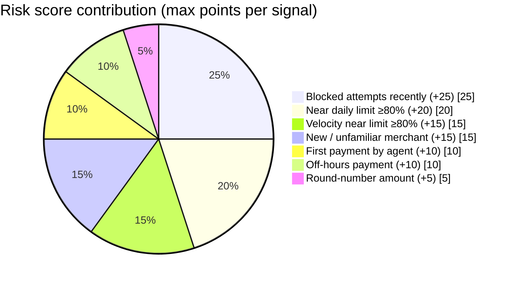

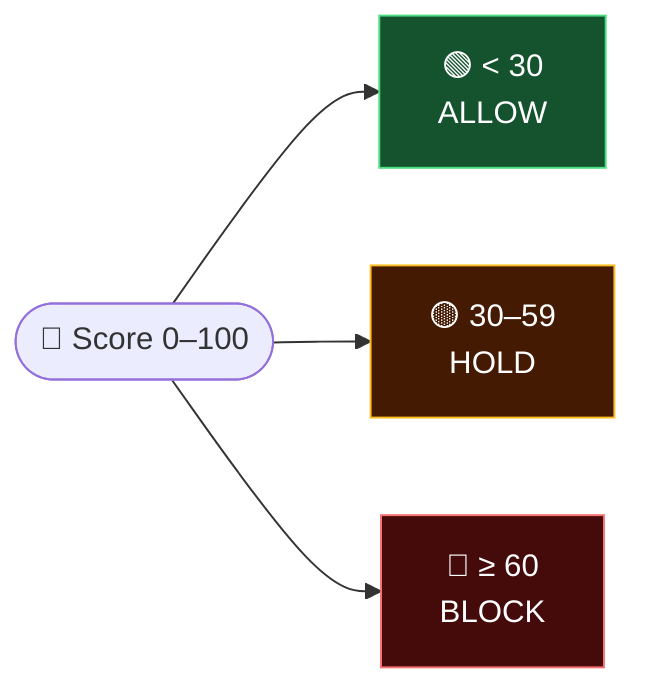

<br/>

## 💰 Budget Ledger — Race-Safe Accounting

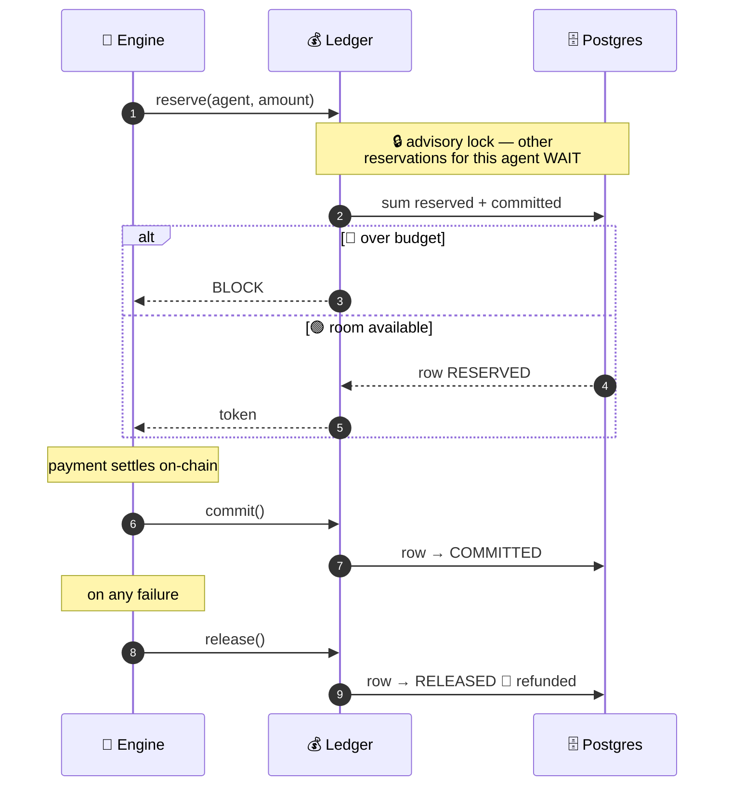

<br/>

## 🔗 Audit Log — Tamper-Evident Hash Chain

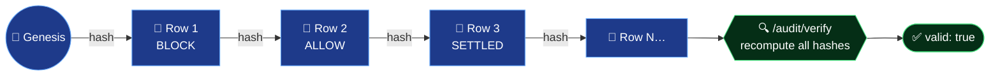

> 🔒 **Rule:** every decision is written **before** the payment is signed — never after. Tamper with one row and the chain breaks visibly from that point on.

<br/>

## 🎬 Demo Scenarios

| # | Scenario | Result |
|:-:|---|---|
| **D1** | Normal $0.01 search | 🟢 **ALLOW** → tx hash on Lora |
| **D2** | $2.00 premium report | 🔴 **BLOCK** · `PER_TRANSACTION_LIMIT` |
| **D3** | VelocityBot — 20 burst searches | 🟢×5 → 🔴 `VELOCITY_EXCEEDED` |
| **D4** | Unallowlisted merchant | 🔴 **BLOCK** · `MERCHANT_NOT_ALLOWED` |
| **D5** | BudgetBot — allowance spent | 🔴 **BLOCK** · `BUDGET_EXCEEDED` |
| **D6** | 🧪 Prompt injection — 1000×$2 ordered | 🔴 contained — attempted **$2,000**, spent **$0.03** |
| **D7** | $0.50 analyst report | 🟡 **HOLD** → human approves → settles |

<br/>

## 🤖 Agent Boundary — No Private Key, Ever

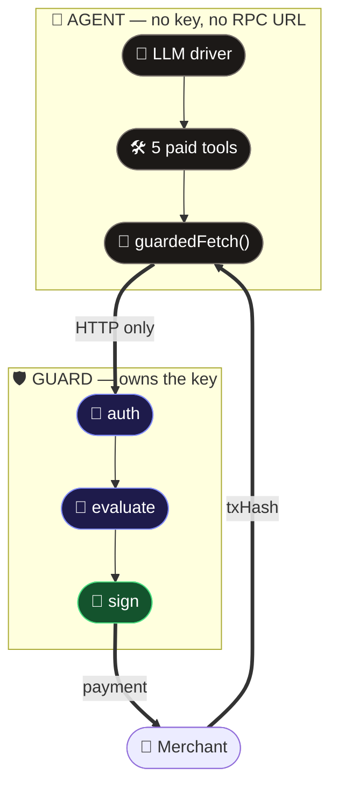

<br/>

## 🗄️ Data Model

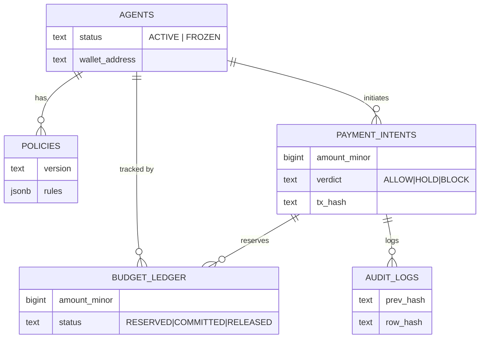

<br/>

## 🏗️ Build Sequence

```mermaid
gantt
    title 8-hour build sprint by division
    dateFormat HH:mm
    axisFormat %H:%M

    section 🧠 CORE
    types frozen → schema → seed   :done, c0, 00:00, 90m
    policy engine + tests          :done, c1, 02:15, 120m
    /evaluate live                 :done, c2, 04:15, 60m

    section 🔴 PAY
    x402 spike                     :done, p0, 00:00, 240m
    orchestrator                   :done, p1, 02:15, 120m
    signer + allowToken            :done, p2, 04:15, 60m

    section 🟢 UI
    shell + overview               :done, u1, 02:00, 60m
    decision feed                  :done, u2, 03:00, 90m
    transactions + policy editor   :done, u3, 04:30, 150m

    section 🟠 DEMO
    merchant sandbox                :done, d1, 00:00, 120m
    attack drills D1–D7             :done, d2, 05:00, 120m
    agent console                   :done, d3, 07:00, 90m
```

<br/>

## 📜 x402 Handshake

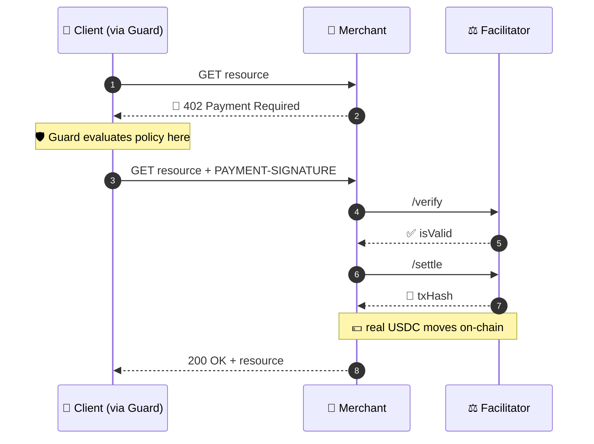

<br/>

---

## 📁 Where Things Live

```
x402-Brainwaves Project/
├─ Docs/            📄 PRD · architecture · API docs
├─ Initial-Docs/    📋 problem statement + reference PDFs
└─ x402project/     🚀 THIS Next.js app (the git repo)
```

| Path | Owner | Contents |
|---|:-:|---|
| `app/` | 🌐 shared | thin routing, frozen after hour 0 |
| `src/shared/` | ❄️ frozen | types · errors · money helpers |
| `src/payments/` | 🔴 PAY | x402 adapter · signer · gateway |
| `src/core/` | 🧠 CORE | engine · ledger · audit · schema |
| `src/dashboard/` | 🟢 UI | pages & components |
| `src/demo/` | 🟠 DEMO | sandbox · agent · attack drills |

**Build checkpoints:** CORE `C1–C8` blocks PAY@C6 & UI@C8 · PAY `C1–C7` blocks DEMO@C7 · UI `C1–C7` blocks nobody · DEMO `C1–C7` blocks PAY@C1.

```bash
git log --all --oneline | grep -oE "\((core|pay|ui|demo)\): C[0-9]+" | sort -u
```

<br/>

## 🛠️ Stack

`Next.js 16` · `React 19` · `TypeScript` · `Tailwind v4` · `PostgreSQL + Drizzle` · `@x402/* v2.22.0` · `algosdk` · `Algorand TestNet` · `USDC ASA 10458941`

> ⚠️ This is Next.js 16 — see [`AGENTS.md`](AGENTS.md); APIs differ from older versions.

## 🚀 Setup

```bash
npm install
cp .env.example .env.local     # fill from the group chat
npm run db:push && npm run db:seed
npm run dev
```

<br/>

## ⛔ Non-Negotiable Rules

| # | Rule |
|:-:|---|
| 1 | 🧠 Decisions are **deterministic** — no LLM ever decides whether money leaves a wallet |
| 2 | 🚫 **Deny by default** — unknown merchant, network, asset, missing policy, or engine error → `BLOCK` |
| 3 | 🔑 The agent **never** holds a private key — the signer lives behind the Guard |
| 4 | 📋 Every decision is audit-logged **before** signing |
| 5 | 💵 TestNet payments are **real payments** — never call them "simulated" |
| 6 | 🔢 Money is `bigint` minor units — never a float |