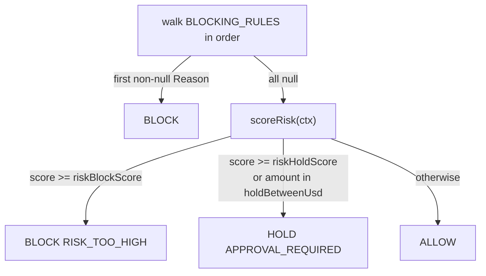
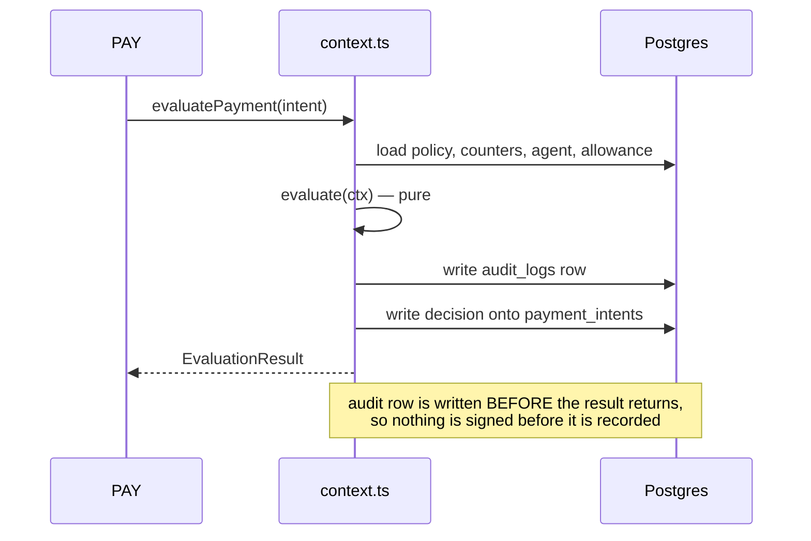

# 🟦 CORE — build checklist

Read [README.md](./README.md) once for context. **This file is your order of work.** Do the
checkpoints top to bottom. One checkpoint = one commit. Never start C(n+1) before C(n) is green.

| | |
|---|---|
| **Branch** | `core/<slice>` — e.g. `core/policy-engine`, one branch per checkpoint or per pair |
| **You own** | `src/core/**` and `src/shared/**` |
| **You never touch** | `src/payments/**`, `src/dashboard/**`, `src/demo/**`, `app/**` route files other people own |
| **You depend on** | Nobody. Your inputs are the DB and `src/shared`. |
| **People waiting on you** | PAY at C6, UI at C8. Everything before that they cover with mocks. |

---

## Before you start

```bash
git pull origin main
npm install
cp .env.example .env.local        # then set DATABASE_URL
npm run db:push
npm run db:seed                   # must print: seeded: 4 agents, 6 policies, 52 intents...
npm test                          # must be green before you write a line
```

If `db:seed` fails, stop and fix that first. Every checkpoint below assumes seeded data.

---

## Commit convention

```
<type>(core): C<n> <what changed>
```

`type` is `feat` `fix` `test` `chore` or `docs`. Examples:

```
feat(core): C1 window keys for hour, day and month buckets
test(core): C2 blocking and passing case for all 10 rules
feat(core): C6 reserve, commit and release under an advisory lock
```

**The checkpoint number in the message is how the team sees progress.** Anyone can run:

```bash
git log --all --oneline | grep -oE "\((core|pay|ui|demo)\): C[0-9]+" | sort -u
```

---

## Progress

Tick the box in the same commit that completes the checkpoint. This file is yours alone, so it
never conflicts with anyone.

| | Checkpoint | Unblocks | Done |
|---|---|---|---|
| C1 | Budget window keys | C6 | ☑ |
| C2 | The 10 blocking rules | C4 | ☑ |
| C3 | Risk score | C4 | ☑ |
| C4 | The engine — `evaluate()` | PAY's real swap | ☑ |
| C5 | Read queries | C7, C8 | ☑ |
| C6 | Budget ledger | 🟥 **PAY** | ☑ |
| C7 | `evaluatePayment()` + audit chain | C8 | ☑ |
| C8 | API handlers | 🟩 **UI** | ☑ |

---

## C1 — Budget window keys

**Goal.** Turn a `Date` into the three text bucket keys the ledger groups by.

**File.** `budget/windows.ts`

**Contract — do not change these formats.** `budget_ledger` rows already store them and the seed
depends on them.

```ts
windowKeys(new Date("2026-08-13T09:30:00Z"))
// { hour: "2026-08-13T09", day: "2026-08-13", month: "2026-08" }
```

UTC always. Never local time — the demo may run in a different timezone than the database.

**Done when.** A test asserts all three keys across a month boundary and a DST-ambiguous local time.

```bash
npm test -- windows
```

**Commit.** `feat(core): C1 window keys for hour, day and month buckets`

---

## C2 — The 10 blocking rules

**Goal.** Each rule is a pure predicate. `null` means it passed. A `Reason` means it failed.

**Files.** `policy/rules.ts`, `tests/policy/rules.test.ts`

**Contract.** The signature and the array order are frozen — the engine walks `BLOCKING_RULES`
top-down and stops at the first non-null.

```ts
type Rule = (ctx: EvaluationContext) => Reason | null;
export const BLOCKING_RULES: Rule[];   // order = precedence, never reorder
```

Every `Reason.code` must already exist in `src/shared/errors.ts`. Every `Reason.rule` is the dotted
policy path, e.g. `"financial.maxPerTransactionUsd"`.

**Hard rule.** No `Date.now()`, no database, no `fetch`, no `Math.random()` in this file. Time comes
from `ctx.now`. ESLint fails the build if you import the DB here.

**Done when.** Each of the 16 `it.todo` entries in `tests/policy/rules.test.ts` is a real test, both
directions — one input that trips the rule, one that passes it.

```bash
npm test -- rules      # 16 passing, 0 todo
```

**Commit.** `test(core): C2 blocking and passing case for all 10 rules`

---

## C3 — Risk score

**Goal.** 7 weighted signals summing to a 0–100 integer.

**Files.** `risk/signals.ts`, `risk/score.ts`

**Contract.**

```ts
scoreRisk(ctx: EvaluationContext): { score: number; signals: RiskSignal[] }
```

Return the individual signals, not just the number — the UI renders them on the transaction detail
page, and "why 71?" is a question a judge will ask.

**Hard rule.** Deterministic. Same context in, same score out, forever. This is not a model.

**Done when.** A test proves the same context scores identically on 100 runs, and that the score is
clamped to 0–100.

**Commit.** `feat(core): C3 deterministic risk score from 7 weighted signals`

---

## C4 — The engine

**Goal.** `evaluate(ctx)` returns ALLOW, HOLD or BLOCK plus the reasons.

**File.** `policy/engine.ts`, `tests/policy/engine.test.ts`

**Order inside the function — this order is the product:**



**Contract.** Pure. Zero I/O. `latencyMs` is measured by the caller in `context.ts`, not here — set
it to `0` and let the caller overwrite it.

**Done when.** Three tests beyond the per-rule ones:

1. Precedence is asserted, not assumed — a context that trips rules 3 *and* 8 reports rule 3.
2. A context that trips nothing returns `ALLOW` with `matchedRules` listing what it checked.
3. A rule that throws does not crash the engine — the caller sees a `BLOCK`.

```bash
npm test -- engine
npm run bench          # p95 under 60 ms
```

**Commit.** `feat(core): C4 policy engine with precedence and fail-closed evaluation`

---

## C5 — Read queries

**Goal.** Implement the read half of `db/queries.ts`. Nothing else in the app may touch the DB.

**File.** `db/queries.ts`

**Implement in this order** — the first four unblock C7, the rest unblock C8:

`getAgentByApiKeyHash` · `getAgentById` · `getActivePolicy` · `getSpendCounters` ·
`listAgents` · `listIntents` · `getIntentById` · `findByIdempotencyKey` · `listPolicyVersions` ·
`listPendingApprovals` · `getMetricsSummary`

**Contract.** `getSpendCounters` returns `SpendCounters` from `@/shared/types` exactly:

```ts
spent    = SUM(COMMIT)
reserved = SUM(RESERVE) - SUM(COMMIT) - SUM(RELEASE)
```

Every money field is `bigint`. Never `Number(...)` a money column.

**Done when.** A script prints correct counters for the seeded `ResearchBot`:

```bash
npx tsx --env-file=.env.local -e "import('./src/core/db/queries').then(async q => console.log(await q.getSpendCounters('<agentId>', new Date())))"
```

**Commit.** `feat(core): C5 read queries for agents, policies, intents and counters`

---

## C6 — Budget ledger 🚨 unblocks PAY

**Goal.** Reserve → commit → release, so concurrent payments cannot both pass the same check.

**Files.** `budget/ledger.ts`, `tests/ledger/concurrency.test.ts`

**Contract — frozen. PAY imports exactly these.**

```ts
reserveBudget(agentId: string, intentId: string, amountMinor: bigint): Promise<Reservation>
commitBudget(reservationId: string, txHash: string): Promise<void>
releaseBudget(reservationId: string, reason: string): Promise<void>
sweepExpiredReservations(): Promise<number>
```

`reserveBudget` throws `BUDGET_EXCEEDED` when a window has no room. TTL is 120 seconds.

**The thing that makes it correct.** All three run inside one transaction that first takes a
per-agent lock:

```ts
// Advisory lock is per-agent so two agents never contend for the same budget row.
await tx.execute(sql`select pg_advisory_xact_lock(${hashAgentId(agentId)})`);
```

Admission check inside the lock: `spent + reserved + amount <= budget`.

**Done when.** The concurrency test passes:

```bash
npm test -- concurrency
```

50 concurrent $0.60 reservations against a $1.00 daily budget must produce **exactly one** success
and 49 `BUDGET_EXCEEDED`. Run it five times. If it ever produces two, the lock is wrong.

**Commit.** `feat(core): C6 reserve, commit and release under an advisory lock`

**Then tell PAY in the group chat.** They swap `@/core/mock` for `@/core` the moment this lands.

---

## C7 — `evaluatePayment()` and the audit chain

**Goal.** The I/O wrapper the engine refuses to be, plus the tamper-evident log.

**Files.** `policy/context.ts`, `audit/log.ts`, `audit/events.ts`

**Contract — frozen.**

```ts
evaluatePayment(input: { intent: PaymentIntent; idempotencyKey?: string }): Promise<EvaluationResult>
```

**Order of operations — this order is a security property, not a preference:**



**Fail closed.** Wrap the whole body in try/catch. Any throw — missing policy, DB down, engine
exception — returns `BLOCK` with `GUARD_UNAVAILABLE`. It must be impossible for an error to read as
an allow.

`audit/chain.ts` is already implemented; use `computeRowHash(prevHash, row)` and `GENESIS_HASH`.

**Done when.**

```bash
npm test -- context
```

- A test kills the DB connection mid-evaluate and asserts `BLOCK`, never `ALLOW`.
- A test asserts the audit row exists before the function returns.

**Commit.** `feat(core): C7 evaluatePayment with fail-closed I/O and audit chaining`

---

## C8 — API handlers 🚨 unblocks UI

**Goal.** Fill the handler bodies. The `app/api/**` route files already re-export them — do not edit
those; edit `handlers/*.ts`.

**Files.** `handlers/*.ts`, `auth/agentKey.ts`, `auth/rateLimit.ts`, plus the write half of
`db/queries.ts`.

**Build in this order** so UI is unblocked earliest:

| Order | Handler | Route |
|---|---|---|
| 1 | `transactions.ts` `transaction-detail.ts` | `GET /api/v1/transactions` |
| 2 | `metrics.ts` | `GET /api/v1/metrics/summary` |
| 3 | `agents.ts` `agent-detail.ts` | `GET /api/v1/agents` |
| 4 | `payments-evaluate.ts` | `POST /api/v1/payments/evaluate` |
| 5 | `policies.ts` `policy-detail.ts` `policy-versions.ts` | `GET/POST /api/v1/policies/*` |
| 6 | `approvals.ts` `approval-approve.ts` `approval-reject.ts` | approvals queue |
| 7 | `budgets.ts` `audit.ts` `audit-verify.ts` `events-stream.ts` `cron-sweep.ts` | the rest |

**Contract — every response goes through the envelope. No exceptions.**

```ts
import { ok, fail } from "@/shared/http";
return ok({ transactions, total });                    // { status, statusCode, data }
return fail("BUDGET_EXCEEDED", { limit: "5.00" });     // { status, statusCode, message, error }
```

Handlers stay thin: validate with Zod → call a lib function → wrap in `ok()`. No business logic in a
handler.

**Money crosses the wire as a decimal string**, never as a `bigint` and never as a `number`. UI
renders the string directly.

**Done when.** Every endpoint UI needs returns real seeded data:

```bash
npm run dev
curl -s localhost:3000/api/v1/transactions | head -40
curl -s localhost:3000/api/v1/metrics/summary
```

**Commit.** One per group above, e.g. `feat(core): C8 transactions and metrics handlers`

---

## Frozen contracts — changing these breaks other people

| What | Who breaks | Protocol |
|---|---|---|
| `src/shared/types.ts` | all four | propose in chat → 3 acks → you commit alone → everyone pulls |
| `src/shared/errors.ts` | UI, PAY | append at the bottom only, never reorder or rename |
| `src/core/index.ts` exports | PAY | announce before changing |
| API response envelope | UI | never — it is `CLAUDE.md` §1 |
| `windowKeys` output format | your own ledger | never after C6 |

---

## If you are blocked

You cannot be blocked by a teammate — nothing you build imports their code. If you are stuck on the
advisory lock or the concurrency test, that is the one place to ask for a second pair of eyes early,
because a wrong lock passes casual testing and fails on stage.
