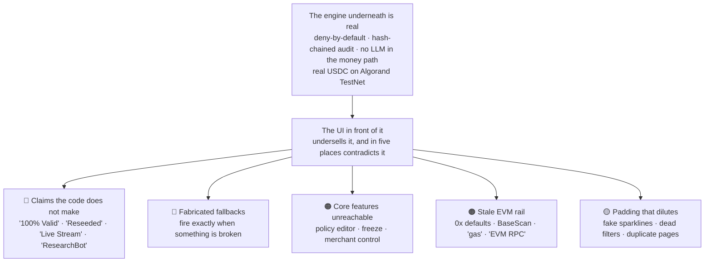
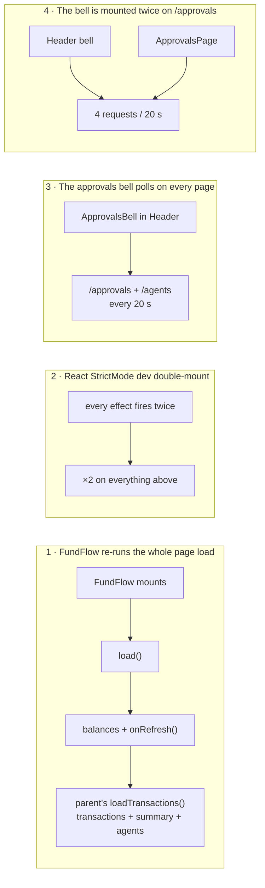
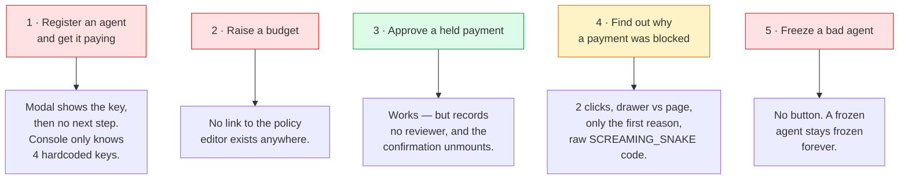

# UI Audit — every page, judge's eye and user's eye

**Date:** 2026-08-19 · **Scope:** all 11 dashboard routes, the shell, the mock layer, and the
network waterfall · **Method:** 20 parallel read-only audits (14 judge-perspective, 6
user-perspective) over `src/dashboard/**`, `src/core/handlers/**`, `src/demo/**`, plus live
verification against the running dev server and a real Algorand TestNet payment.

**294 findings.** This document is the ranked, de-duplicated, verified subset. Nothing here has
been changed yet.

> **Confidence marks used below**
> ✅ **verified live** — I reproduced it against the running server or read the exact line
> 📋 **reported** — found by an audit agent, evidence cited, not independently re-run

---

## 0. The shape of the problem



The single sentence that summarises the whole audit:

> **The product is more trustworthy than its own dashboard makes it look.** Almost every finding
> here is the UI *claiming* something instead of *showing* the true thing that already exists one
> layer down.

---

## 1. Fix these ten before you submit

Ranked by *damage a judge does to you if they notice*, not by effort.

| # | What | Where | Why it is #1-10 | Effort |
|---|---|---|---|---|
| 1 | **"Live Decision Stream / SSE Stream Active" can never receive an event** ✅ | `useLiveDecisions.ts:103` vs `events-stream.ts:14` | Server sends **named** SSE events (`event: decision`), client only listens on `es.onmessage`, which fires **only for unnamed events**. I settled a real $0.05 payment with the page open — the feed did not move. A green "Active" badge over a frozen list. | S |
| 2 | **"Reset Demo" fakes success** ✅ | `header.tsx:26-36, 84` | 600 ms `setTimeout`, no request, then a green ✓ "Reseeded". On every page. It is a control that lies about a database write. | S |
| 3 | **Audit page hardcodes "Hash Chain Verified · 100% Valid"** ✅ | `audit.tsx:87-89` | `verify.valid` and `verify.brokenAt` are fetched and **never read** — only `rowsChecked` is used. The banner is a literal. Your best technical asset is presented as a sticker. | S |
| 4 | **Every transaction detail page says the agent is "ResearchBot"** ✅ | `transaction-detail.tsx:239` | `transaction.agentName \|\| "ResearchBot"` — and `agentName` does not exist on `toIntentDto`, so it is **always** undefined. Every payment by every agent is attributed to one bot, on the page that is supposed to be your evidence screen. | S |
| 5 | **Policy editor is unreachable by clicking** ✅ | zero `/policies` hrefs in the whole app | Grep confirms: no link anywhere. The page proving "configurable policies" — your one-line product claim — can only be reached by typing a URL with a raw agent id. | S |
| 6 | **Saving any real policy is rejected** ✅ | `policyRules.ts:20` | `pinnedRecipients: z.record(z.string().regex(/^0x[a-fA-F0-9]{40}$/))`. Your live policies pin a **58-char Algorand address**. The schema cannot express the system it governs. Same bug in `merchants.ts:14`. | S |
| 7 | **The "Simulate Impact" tab crashes against the real server** ✅ | `policy-simulation-results.tsx:17,305` vs `policy-simulate.ts:93` | UI types `reasons: string[]` and renders `{r}`; server sends `{code, rule, message}` objects → React throws. It works in MSW because `handlers.ts:172` returns strings. Your killer feature was only ever tested against the mock. | S |
| 8 | **"Test Server Validation Rejection" silently raises the limit 50×** ✅ | `policy-form.tsx:98-125` | It POSTs `maxPerTransactionUsd: "5.00"` expecting a rejection. **No cross-field rule exists** in `policyRulesSchema` or `policies.ts`. The call succeeds and writes a live policy version. A debug button next to Save that quietly loosens a spend ceiling. | S |
| 9 | **D6 — the hero prompt-injection drill — is stopped by the attacker, not by you** ✅ | `d6-prompt-injection.ts:12,67` + `orchestrator.ts:107` | The attack passes `maxAmountUsd: "0.10"`, and the orchestrator checks the **caller's own declared ceiling before `evaluatePayment` is ever called**. The block is attributed to `gateway.maxAmountUsd`. The code comment even says "until CORE's policy engine lands". Drop `maxAmountUsd` and let the engine refuse it. | S |
| 10 | **Freeze/unfreeze has an API, a route and a constant — and no button** ✅ | `endpoints.ts:10`, never called | `API.freeze` is imported nowhere. Unfreeze and rotate-key are not even in `endpoints.ts`. A **frozen agent can never be unfrozen through the UI**, and you lose the single most interactive proof available: stop an incident in one click, re-run, watch Rule 1 fire. | S |

**All ten are S-effort.** That is the encouraging part: this is a day of work, not a rebuild.

---

## 2. Why the same API is called so many times

You asked about the DevTools waterfall. I measured it — Playwright, one page view, no preserve-log.

### Measured, per page

| Page | API calls | Unique endpoints | What the extras are |
|---|---|---|---|
| `/transactions` | **22 in 65 s** | 5 | 4× the page's own 3-call load, plus a 20 s poll |
| `/agents` | **18 on first paint** | 4 | 5 agents × 2 budget calls (N+1), doubled |
| `/approvals` | **12 in 45 s** | 2 | the poll running **twice**, independently |
| `/overview` | **4** | 2 | just StrictMode doubling — this page is clean |

### The four causes



| # | Cause | Evidence | Cost | Fix | Effort |
|---|---|---|---|---|---|
| 1 | `FundFlow.load` calls `onRefresh()` **on mount**, not only on the Refresh click — so mounting the panel re-runs the parent's entire 3-call page load ✅ | `fund-flow.tsx:152,163` | doubles `/transactions`, `/metrics/summary`, `/agents` | split `loadBalances` (effect) from `refreshAll` (button) | S |
| 2 | React StrictMode double-invokes every effect in dev ✅ | Next 16 default; `next.config.ts` sets nothing | ×2 on everything | **none — this does not happen in `next build`.** Measure with a production build before optimising | — |
| 3 | The bell fetches `/api/v1/agents` every 20 s **only to map agentId → name**, and never renders a name ✅ | `usePendingApprovals.ts:61,92` | 3 wasted roster fetches/min on **every page** | drop the roster fetch from the bell, or fetch it once | S |
| 4 | `usePendingApprovals` is mounted by both the bell and the page ✅ | `approvals-bell.tsx:15` + `approvals.tsx:54` | 4 requests/20 s instead of 1 | lift into a context provider, or skip the bell's poll on `/approvals` | S |
| 5 | `/api/v1/transactions` **already returns the metrics summary**, and the page fetches `/metrics/summary` again 📋 | `transactions.ts:20,28` | 1 wasted call + 1 wasted DB aggregate | read `summary` off the transactions response | S |
| 6 | `/agents` does one `/budgets/:agentId` per agent (N+1) 📋 | `agents-list.tsx:90` | 5 calls now, 20 with 20 agents | acceptable for the demo; note it and move on | — |
| 7 | 1-second `setNowMs` tick runs even when the queue is empty 📋 | `usePendingApprovals.ts:96` | 60 renders/min, 0 requests | gate on `approvals.length > 0` | S |

**Bottom line:** nothing is looping out of control. Fixes 1, 3 and 4 take `/transactions` from
22 calls to about 7, and `/approvals` from 12 to 3. Do those three and stop.

> **The honest headline for a judge:** roughly half of what you saw is Next.js dev mode. Run
> `next build && next start` before you show anyone a Network tab.

---

## 3. Cross-cutting problems

These are not page bugs. They are one bug repeated on many pages, so fix them once.

### 3.1 🔴 Fabricated fallbacks — the highest-damage pattern in the codebase

A fallback like `?? 30` only ever renders **when something is broken**. So every one of these is a
tripwire that fires at the worst possible moment and prints a confident, plausible lie.

| Value shown | Where | Fires when |
|---|---|---|
| `"ResearchBot"` ✅ | `transaction-detail.tsx:239` | **always** — the field does not exist |
| `"30 payments settled on-chain"` ✅ | `overview.tsx:264` | the metrics API is down |
| `"24 ms"` ✅ | `overview.tsx:420` | the metrics API is down |
| `"0.054 ms"` latency 📋 | `tx-detail-drawer.tsx:199` | `latencyMs` is null |
| `"0x9a2B...4a6B"` recipient ✅ | `transaction-detail.tsx:262` | recipient missing — **on an Algorand product** |
| `policyVersion "3"` ✅ | `transaction-detail.tsx:247`, `policy-editor.tsx:38,190,260` | version missing |
| `riskScore "12"` 📋 | `transaction-detail.tsx:282`, `tx-timeline.tsx:74` | score is 0 or missing |
| `latencyMs "18"` 📋 | `transaction-detail.tsx:288` | `\|\|` also fires on a legitimate **0** |
| `$0.05 / localhost:3000 / ResearchBot` 📋 | `useLiveDecisions.ts:110-118` | any partial SSE event |
| budget `$1.00`, `$23.65`, velocity counts 📋 | `budget-gauge.tsx:16`, `agent-detail.tsx:278-311` | budget API slow or failed |

**Rule to adopt:** `?? 0` is fine. `?? 30`, `?? 24`, `?? 12`, `|| 18`, `|| 3`, `|| "ResearchBot"`
are not. Render an em dash `—` and let the gap show. *A blank is honest; a plausible number is a
lie you told confidently.*

### 3.2 🔴 Error states that render as success

Three of the pages an operator uses to make a **financial** judgement paint a healthy screen when
their fetch failed.

| Page | Mechanism | Result |
|---|---|---|
| Overview ✅ | `setError` declared at `:151`, **never called**; catch at `:164` only `console.error`s | error branch at `:233` is dead code; outage renders a full dashboard of zeros + two invented numbers |
| Audit ✅ | `verify.valid` fetched, never read | banner says "100% Valid" whatever the verifier returned |
| Policy editor 📋 | load error swallowed at `:63`; `loading` never cleared | form presents **hardcoded default rules** as the agent's live policy — and "Create Immutable Version" then writes them |
| Transactions 📋 | `console.error` at `:57` | table reads "No transactions match the selected filters" with no filter applied |

**Adopt one convention** — an `<ErrorCard message={...} onRetry={...}/>` used by every page — and
never let a catch block end in `console.error` alone.

### 3.3 🟠 Stale EVM rail — you are Algorand-only

| Leak | Where | Impact |
|---|---|---|
| Policy `pinnedRecipients` must match `/^0x…{40}$/` ✅ | `policyRules.ts:20` | **every real policy save is rejected** |
| Merchant `pinnedRecipient` same regex ✅ | `merchants.ts:14` | merchant pinning API unusable |
| Agent detail `walletAddress` EVM regex 📋 | `agent-detail.ts:14` | |
| `"EVM RPC call"` in the blocked panel 📋 | `tx-detail-drawer.tsx:144` | wrong chain, on the block-proof panel |
| `explorerName()` falls back to `"BaseScan"` 📋 | `explorer.ts:124` | |
| `"Zero-Gas"`, `"0 gas spent"` 📋 | `overview.tsx:374`, `simulator.tsx:59,95,231`, `tx-timeline.tsx:164` | ALGO has fees; the facilitator pays them. Say **"no transaction submitted"** |
| PolicyForm default pins a 0x address 📋 | `policy-form.tsx:40` | seeds the bad value into new policies |
| 1,183 lines of Base Sepolia MSW fixtures 📋 | `mock/fixtures.ts`, `mock/handlers.ts` | one env flag from painting Base data over your Algorand demo |

### 3.4 🟠 Controls that do nothing

| Control | Where | Status |
|---|---|---|
| "Reset Demo" ✅ | `header.tsx:88` | 600 ms sleep, fake success |
| "Gateway Live" badge 📋 | `header.tsx:76` | static `<span>` with `animate-pulse`; green while the backend is down |
| "Last 24 hours ∨" pill 📋 | `transactions.tsx:102` | a `<div>`; and the query has **no** time window |
| "Filters" button 📋 | `transactions.tsx:108` | no `onClick` |
| "More filters" 📋 | `tx-table.tsx:118` | no `onClick` |
| "Polling Active" badge 📋 | `decision-feed.tsx:67` | nothing polls |
| `risk.autoApproveBelowUsd` input 📋 | `policy-form.tsx:287` | the engine never reads this field |
| Audit filters 📋 | backend supports `agentId`/`intentId`; page sends neither | |

`/api/v1/transactions` already accepts `?decision=ALLOW|HOLD|BLOCK`. Three segmented buttons wired
to that turns the worst dead control into your best one: *"show me only the refusals."*

---

## 4. Page by page

### Scoreboard

| Page | Value to the story | Verdict | The one thing |
|---|---|---|---|
| `/overview` | ★★★ core | **keep, re-cut** | 85vh of cartoon sky before any enforcement number |
| `/transactions` | ★★★ core | **keep, fix** | "$0.10 Prevented" above 10 blocked rows worth $2,007 |
| `/transactions/[id]` | ★★★ core | **rework** | throws away the ledger + audit rows the server already sent |
| `/agents` | ★★ supporting | **keep** | healthiest page in the app; needs a freeze button |
| `/agents/[id]` | ★★ supporting | **keep, fix** | dead "Live" feed; fabricated gauge fallbacks |
| `/policies/[id]` | ★★★ core | **rework + link it** | unreachable, unsaveable, and the Simulate tab crashes |
| `/approvals` | ★★★ core | **keep** | recently rebuilt and honest; needs reviewer identity |
| `/merchants` | ★ nice-to-have | **merge into policies** | read-only, permanently fake "24h Vol: $0.00" |
| `/audit` | ★★★ core | **rework** | real hash chain, fake "100% Valid" badge |
| `/simulator` | ★★★ core | **keep, fix copy** | card copy written against the MSW mock |
| `/console` | ★★★ core | **keep, promote** | best screen on the site, 7th in the nav |

---

### `/overview` — the landing page

**User's first 60 seconds.** The hero is `min-h-[85vh]`. It contains the word WARDEN and the
tagline "Control autonomous spending". Nothing says *money*, *AI agents*, or *payments*. The
clearest description of the product in the entire application is **the alt text on the hero
image** (`warden-illustration.tsx:14`) — invisible to every sighted user. The string "x402"
appears once, in a sidebar that is never rendered.

| Action | Item |
|---|---|
| ➕ **Add** | One `<p>` under the tagline: *"Your AI agents can spend money on their own. WARDEN checks every payment against your rules before it is signed — approving the safe ones, blocking the rest."* |
| ➕ **Add** | A nav — once you scroll past the hero there is **no navigation at all** on this route (`shell.tsx:12` skips the Header on `/overview`), which also hides the approvals countdown on the default landing page |
| ➖ **Remove** | Four hand-drawn `<path d="M 0,45 C 50,55…">` sparklines under four real numbers (`:281,338,389,442`) — decoration in the visual slot where evidence belongs |
| ➖ **Remove** | `?? 30` and `?? 24` fallbacks (`:264,420`); call `setError` in the catch at `:164` |
| ➖ **Remove** | Hardcoded `"($0.10)"` in the reason-label map (`:36`) — no agent has that limit (`seed.ts:243` is $0.05, the rest $1.00) |
| 🔄 **Change** | Caption "Sub-millisecond pure function eval" sits under a measured **88 ms** ✅. Say "P95 end-to-end, incl. budget reads" |
| 🔄 **Change** | Relabel "Blocked On-Chain: 0" → **"Blocked payments that reached the chain: 0 of 10"**. This is goal G2, your primary success metric, and it currently reads as an empty placeholder |
| 🔄 **Change** | Reorder: enforcement tiles above the fold, hero shorter |
| 🔧 **Fix** | Tiles fetch once and never refresh — trigger a live block on stage and they do not move |

---

### `/transactions`

| Action | Item |
|---|---|
| 🔧 **Fix** | **"MONEY PROTECTED"** uses the 24 h metrics window while the table below has **no window** ✅. Right now: tile `$0.10`, table 10 BLOCK rows totalling **$2,007.64**. Either window both, or label the tile "last 24 h" |
| ➖ **Remove** | "Last 24 hours" pill, "Filters", "More filters" — all three inert |
| ➖ **Remove** | Two more fake bezier sparklines (`:154,203`) |
| ➖ **Remove** | Progress bars multiplied by `×2` and `×4` (`:280,286`) so they disagree with the percentages printed beside them |
| ➕ **Add** | A **reason column**. A BLOCKED row currently shows no *why* in the list — `reason-chip.tsx` already exists and `reasons` is already in the payload |
| ➕ **Add** | Decision filter buttons wired to the `?decision=` param the handler already accepts |
| ➕ **Add** | `blockedOnChainTxCount` — fetched at `:19` and thrown away. It is goal G2 |
| 🔧 **Fix** | Relative times render as **"8544m ago"** (`tx-table.tsx:236`) |
| 🔧 **Fix** | Drawer prints hardcoded `"0.054 ms"`, says `"EVM RPC call"`, invents `"POLICY_COMPLIANT"` in red, and claims "Signed and broadcast" for 41 rows with no tx id |
| 🤔 **Decide** | Row click opens a **drawer**; the runbook's ⭐ step describes the **page**. Two divergent views of one intent. Pick one — deleting `tx-detail-drawer.tsx` (315 lines) is the cheaper direction |

---

### `/transactions/[intentId]` — your evidence screen

This is the page that has to prove *"audited before signing"*. It currently proves nothing:
`transaction-detail.ts` returns `{ transaction, ledger, audit }` and the page **discards `ledger`
and `audit`** (`:49-50`), replacing the real hash-chained trail with a hand-written four-step story
in `tx-timeline.tsx`.

| Action | Item |
|---|---|
| 🔧 **Fix** | `agentName \|\| "ResearchBot"` — always fires ✅ |
| ➕ **Add** | **Render the audit rows.** Show `DECISION` written *before* `PAYMENT_SETTLED`, with `prevHash → rowHash`. That is the whole claim, and the data is already in the response |
| ➕ **Add** | Render the ledger (RESERVE → COMMIT/RELEASE) — proves budget was reserved before signing |
| ➕ **Add** | Approval reviewer, note, `actionedAt` — the human-in-the-loop story is invisible |
| ➕ **Add** | `riskSignals` (not just the bare score), **all** reasons (only the first is shown), links to the agent and to the rule that fired |
| ➕ **Add** | Approve/Reject buttons on a HOLD |
| ➖ **Remove** | `|| "0x9a2B...4a6B"`, `|| 3`, `?? 12`, `|| 18`, `"Sub-50ms deterministic"` |
| 🔧 **Fix** | A rejected or expired hold still renders "Awaiting Human Review" |

---

### `/agents` and `/agents/[id]`

The list page is the **healthiest page in the app** after its rewrite — real budgets, real decision
mix, honest "not available" states, no Base leakage.

| Action | Item |
|---|---|
| ➕ **Add** | **Freeze / Unfreeze button.** Server-side it is done. This is US8 and Rule 1 — the first check in the engine and the most demoable |
| ➕ **Add** | A link from "Active Policy v3" → `/policies/[agentId]`. One `<Link>` closes the biggest navigation hole in the app |
| ➕ **Add** | Per-agent allow/hold/block counts on the card (already computed at `agents-list.tsx:116`, only rendered in a chart at the bottom) |
| ➕ **Add** | The rail name on the card — `wallet.network` is fetched and dropped |
| ➖ **Remove** | `BudgetBars` duplicates the per-card budget bar exactly. Cut one |
| ➖ **Remove** | Fabricated gauge fallbacks on the detail page (`:278-311`) and hardcoded `createdByEmail: "operator@aspg.dev"` |
| 🔧 **Fix** | "Allowance pool $110.00 / Combined wallet ceilings" — 2.5× the ceiling the engine actually enforces |
| 🔧 **Fix** | An agent with **no active policy** renders "Agent Not Found" — every freshly registered agent hits this dead end |
| 🔧 **Fix** | Detail page's "Live Decision Stream" — dead (see #1), and captioned "across all active agent wallets" on a single-agent page |

---

### `/policies/[agentId]` — the page that proves your one-line claim

Four independent failures stack here. **This is the highest-leverage page in the audit.**

| Action | Item |
|---|---|
| 🔧 **Fix** | Unreachable — zero inbound links ✅ |
| 🔧 **Fix** | `pinnedRecipients` 0x regex rejects every Algorand policy ✅ |
| 🔧 **Fix** | Simulate tab crashes on real data (objects rendered as strings) ✅ |
| ➖ **Remove** | "Test Server Validation Rejection" — it *succeeds* and raises the ceiling to $5.00 ✅ |
| ➖ **Remove** | `risk.autoApproveBelowUsd` input — the engine never reads it |
| ➕ **Add** | The rules the engine enforces but the form cannot set — notably `unknownMerchantAction`, your deny-by-default proof |
| ➕ **Add** | Field-level validation errors (`error.details.issues` is discarded; user sees only "Request failed validation.") |
| ➕ **Add** | `createdByEmail` in version history; mark what actually differs in the Version Diff |
| 🔄 **Change** | Promote **Simulate** from tab 4 to tab 1. "Change the rule, replay 200 real historical payments, see what would have changed — *then* save" is the best 30 seconds in the product |
| 🔍 **Say out loud** | Replay reuses historical spend counters. Saying so scores better than hoping nobody asks |

---

### `/approvals`

Recently rebuilt; every number is server-derived. Remaining gaps are about the *reviewer*.

| Action | Item |
|---|---|
| ➕ **Add** | Reviewer email + note fields — both endpoints accept them, the UI sends neither, so the audit trail records "dashboard" approved a payment |
| ➕ **Add** | The **payee address**. A reviewer currently releases money without seeing where it goes |
| 🔧 **Fix** | The outcome banner is written to a card that `resolve()` unmounts in the same commit — the reviewer sees the card vanish and no confirmation |
| 🔧 **Fix** | "Approved" is reported even when re-evaluation **blocked** it; the reasons are discarded |
| 🔧 **Fix** | Expired holds stay `PENDING` forever — nothing sweeps them |
| 🔍 **Say out loud** | Approving **records + re-evaluates**; it does not broadcast. The agent must retry. Already partly worded — make it prominent |

---

### `/merchants` — **candidate for deletion**

| Action | Item |
|---|---|
| ➖ **Remove** | `"24h Vol: $0.00"` — hardcoded on every card (`:50-51,64-65`), and it contradicts the non-zero spend tile on the Overview |
| ➖ **Remove** | Hardcoded display names from string equality on two domains |
| 🔧 **Fix** | The rogue merchant that drill D4 blocks is rendered as a green **ALLOWED** card |
| 🔧 **Fix** | `unknownMerchantAction` — your deny-by-default proof — is fetched, typed, then dropped |
| ➕ **Add** | An explanation of `RECIPIENT_MISMATCH`. It is the most impressive rule in the engine and this is the page that owns it |
| 🤔 **Decide** | The page is **entirely read-only** while claiming "Merchant Controls". The real control lives in the policy editor's merchant section. **Merge it there and drop it from the nav** — one fewer page to defend, one more reason to visit the policy screen |

---

### `/audit` — best asset, worst presentation

The chain is real, correctly implemented, and recomputed server-side on every request. Nothing on
the page says so.

| Action | Item |
|---|---|
| 🔧 **Fix** | Read `verify.valid` and `verify.brokenAt` instead of printing "100% Valid" ✅ |
| ➕ **Add** | A **Verify now** button. Watching a judge click it and see the chain recomputed live is worth more than the whole Overview page |
| ➕ **Add** | Show `prevHash → rowHash` linkage visually. Render `agentId`, `intentId`, `actor`, `payload` — the page renders **4 of the 10 fields** it fetches |
| ➕ **Add** | Filters — the backend supports `agentId`/`intentId`, the page sends neither |
| 🔧 **Fix** | `entry.id` is always `undefined` — the page reads **mock** field names, not `auditId` from the API |
| ⚠️ **Seed gap** | The seed writes only `PAYMENT_SETTLED`/`BLOCKED`/`HELD` ✅. **Zero `DECISION` rows.** After a fresh reseed the page cannot show decide-before-settle. Your live DB has 140 `DECISION` rows *from real runs* — so either run a payment before demoing, or add `DECISION` events to the seed |
| 🔍 **Say out loud** | "The chain is not stored as valid — it is recomputed from the rows on every request." Also be upfront that `createdAt` is **not** covered by the hash |

---

### `/simulator`

The proof grid the enforcement story rests on. The engine is right; the **card copy was written
against the MSW mock** and advertises reason codes and prices the real drills never emit.

| Action | Item |
|---|---|
| 🔧 **Fix** | **D6 is blocked by the attacker's own ceiling, not by the Guard** ✅ — remove `maxAmountUsd` from the D6 call so the policy engine is what refuses it |
| 🔧 **Fix** | "Run All" has no `maxDuration` and D7 waits 5 minutes for a human → hang or 504 |
| 🔧 **Fix** | "Blocked Spend" always `$0.00` — the handler never returns the summed fields |
| ➖ **Remove** | `"~0.055ms"` on D1 — copied from `mock/handlers.ts:319` |
| ➖ **Remove** | `"Attack On-Chain Txs: 0 (Zero-Gas)"` — hardcoded literal, wrong rail |
| 🔧 **Fix** | A failed run renders a **fabricated gateway transcript** instead of the real error |
| 🔧 **Fix** | Terminal builds **Base Sepolia** explorer links |
| 🔄 **Change** | Rename it. Project rule 5 says these are real TestNet payments; "Simulator" undersells them. **"Attack Drills"** |
| 🔄 **Change** | Each card should name **the rule it proves**, not a marketing claim |
| 🤔 **Decide** | D7 duplicates the console's human-in-the-loop and cannot complete unattended — cut it from Run All |

---

### `/console` — your best screen

A real model spending real TestNet USDC through the real gateway, agent intent and Guard veto side
by side. It is 7th of 8 in the nav.

| Action | Item |
|---|---|
| 🔄 **Change** | **Move it to position 2 in the nav.** This is the demo |
| ➕ **Add** | The **block reason message** — only the raw `SCREAMING_SNAKE` code reaches the UI; the human sentence is dropped at `guardedFetch.ts:110` |
| ➕ **Add** | The enforcing limits on screen (per-tx cap, budgets). Without them BLOCK and HOLD look arbitrary |
| ➕ **Add** | One line: *"Sandbox sellers return fixed content; the 402 handshake, the signature and the settlement are real."* — see §6 |
| ➕ **Add** | One line explaining `GUARD_KEYS`: *"Demo keys. A Guard key authorises a payment **request**; the signing key lives server-side and never reaches a browser."* Rename to `DEMO_GUARD_KEYS` |
| 🔧 **Fix** | A settlement **failure** is painted as a policy BLOCK and claims nothing was signed |
| 🔧 **Fix** | Totals use the price table, not the amount the gateway settled |
| 🔧 **Fix** | A newly registered agent **cannot be used here** — the console only knows 4 hardcoded keys |
| 🔄 **Change** | Move the enforcement counters above the fold |

---

### Shell and navigation

```
Three different navigation lists, none of which can reach the policy editor:

  Header TOP_NAV     Overview · Transactions · Agents · Approvals · Merchants
  (rendered)         Audit Log · Agent Console · Simulator          ← no Policies

  Sidebar NAV        …includes Policies → /policies                 ← 404, and
  (never rendered)                                                     never mounted

  Hero buttons       a third, hand-written set                      ← cannot reach Console
  (on /overview)
```

| Action | Item |
|---|---|
| ➖ **Delete** | `sidebar.tsx` — dead code, and its one distinct link 404s |
| ➖ **Delete** | `mock/` — 1,183 lines of Base Sepolia fixtures, one env flag from painting stale data over your demo. It is also *why* the Simulate crash and the D1 latency claim were never caught |
| ➖ **Delete** | "Reset Demo" (or wire it to a real endpoint) |
| 🔧 **Fix** | "Gateway Live" — make it reflect an actual health check, or remove it |
| ➕ **Add** | Below 768px there is **no navigation whatsoever**; between 768px and ~1270px the header **overflows the viewport** — that includes a 1280 laptop with devtools open, which is exactly your screenshot |
| ➕ **Add** | Tie "WARDEN" to "Agent Spend Policy Guard" somewhere visible — the PS-1 name appears only in the browser tab |

---

## 5. The user's point of view

Five jobs an operator has. **Three are impossible through the UI.**



### Other user-facing gaps

| Kind | Finding |
|---|---|
| **Dead end** | A newly registered agent can never pay — `console.tsx:78` has 4 hardcoded keys |
| **Dead end** | The guard key can be destroyed by one stray click on ✕, and there is no rotate-key UI |
| **Dead end** | An agent with no policy renders "Agent Not Found" |
| **Consistency** | **Six** money formats; the console shows dollar amounts **with no `$`** |
| **Consistency** | **Ten** timestamp formats across the dashboard |
| **Consistency** | **HOLD is called seven different things** on seven screens |
| **Consistency** | "Money committed but not yet spent" has four names (reserved / pending / held / in flight) |
| **Copy** | Block reasons shown as bare `MERCHANT_NOT_ALLOWLISTED` with no sentence — `shared/errors.ts` already has human messages |
| **Copy** | Unexplained jargon: `intentHash`, CAIP-2, ASA, "opted in", minor units, `matchedRules` |
| **Copy** | Hackathon-judge copy shipped inside the operator UI (`simulator.tsx:95,184,188`) |
| **Safety** | Approve releases money with **no confirmation step** |
| **Safety** | Save policy: no diff, no confirm, self-destructing success message |
| **A11y** | Transaction rows are clickable `<tr>` — no keyboard access to your money-shot page |
| **A11y** | Icon-only buttons with no accessible name; drawer not focus-managed; focus ring removed on a select |
| **A11y** | Empty-state copy is the lowest-contrast text on the page |
| **Bad state** | `budget-gauge` divides by a fabricated `$1.00` when the budget is 0; `velocity-meter` renders **"NaN%"** and a red "Trip Limit Exceeded" when the limit is 0 |
| **Bad state** | Fund-flow wallet panels shimmer forever if `/wallets/balances` fails |

---

## 6. Be more transparent — it scores better

Two things are true and unstated. Saying them **gains** points; being caught on them loses points.

> **1. The sandbox sellers return fixed content.**
> `src/demo/sandbox/data.ts` returns the same bytes every call. `factCheck` always returns
> `"supported"`. **Your own model noticed this during a live run** — *"The search returned
> unrelated results (maybe sandbox)."* A judge will too.
>
> **What to put on `/console` and `/simulator`:**
> *"Sandbox sellers return fixed content so the demo never depends on someone else's uptime.
> Everything about the money is real: the 402 handshake, the signature, and the USDC settlement on
> Algorand TestNet."*

> **2. The Guard keys in `console.tsx` are demo keys, not signing keys.**
> Unexplained, `gk_live_…` in client JS looks like leaked credentials. Explained, it *reinforces*
> your strongest architectural claim: the agent never holds a private key.

### The most impressive true facts the UI never states

| Fact | Where it lives | Where it should be said |
|---|---|---|
| No LLM is in the money path — the decision is a deterministic pure function | `core/policy/engine.ts` | Overview, one line |
| The audit chain is **recomputed** server-side, not stored as a flag | `core/audit/chain.ts` | `/audit`, next to a Verify button |
| The agent never holds a private key | `payments/wallet/signer.ts` | Console |
| Blocked payments that reached the chain: **0** | `metrics.ts` | Overview, as the headline |
| `intentHash` binds the signer to exactly the approved terms (threat T9) | `payments/intent/hash.ts` | Transaction detail |
| Policy changes can be replayed against 200 real historical payments before saving | `policy-simulate.ts` | Policy editor, tab 1 |

---

## 7. What to cut

| Cut | Lines | Why |
|---|---|---|
| `src/dashboard/mock/` | ~1,183 | Base Sepolia fixtures; the reason two critical bugs were never caught |
| `src/dashboard/shell/sidebar.tsx` | 89 | never rendered; its one distinct link 404s |
| `tx-detail-drawer.tsx` **or** `transaction-detail.tsx` | ~315 | two divergent views of one intent; the runbook trips over the difference |
| `/merchants` page | 183 | read-only, fake volume; merge into the policy editor |
| Six fake sparklines | ~90 | decoration in an evidence slot |
| "Reset Demo", "Filters", "More filters", date pill | ~40 | dead controls |
| "Test Server Validation Rejection" | ~30 | does the opposite of its label |
| D7 from Run All | — | duplicates the console and cannot complete unattended |

---

## 8. Suggested demo order

Current nav order buries both pages that prove enforcement live.

| Now | Suggested | Why |
|---|---|---|
| 1 Overview | 1 **Overview** | but re-cut so enforcement leads |
| 2 Transactions | 2 **Agent Console** | a live agent spending real money — lead with it |
| 3 Agents | 3 **Transactions** → detail | the refusal, and the proof no tx exists |
| 4 Approvals | 4 **Approvals** | human-in-the-loop, with a live TTL |
| 5 Merchants | 5 **Policies** | change a rule, simulate, save |
| 6 Audit Log | 6 **Audit** | click Verify in front of them |
| 7 Agent Console | 7 **Attack Drills** | D2/D4/D6 as the closer |
| 8 Simulator | ~~Merchants~~ | merged away |

---

## 9. Fix plan

```mermaid
gantt
    title Suggested order
    dateFormat X
    axisFormat %s
    section Day 1 — stop the bleeding
    Ten items from section 1 (all S)        :0, 8
    section Day 1 — cheap wins
    Delete fake sparklines and dead controls :8, 10
    Delete mock/ and sidebar.tsx             :10, 11
    Fix the redundant API calls (3 edits)    :11, 12
    section Day 2 — earn the points
    Render ledger and audit on tx detail     :12, 16
    Freeze button and policy links           :16, 18
    Transparency lines and copy pass         :18, 21
    section Day 2 — polish
    Money and timestamp formats, HOLD naming :21, 23
    Mobile nav and keyboard access           :23, 24
```



| Tier | Items | Effect |
|---|---|---|
| **A — before anything else** | §1's ten | removes every claim the code cannot back |
| **B — same day, all S** | §3.1 fallbacks, §3.4 dead controls, delete `mock/` + `sidebar.tsx`, 3 network fixes | removes the "what else is fake?" reflex |
| **C — highest return** | render ledger + audit on tx detail, freeze button, policy links, Verify button | turns existing backend work into visible credit |
| **D — polish** | money/time/HOLD consistency, jargon, mobile nav, keyboard access | |

---

## 10. Method and caveats

- 20 read-only agents, ~2.3M tokens, 738 tool calls. Every finding required `file:line` evidence.
- Items marked ✅ I re-verified myself: by reading the exact line, querying the live API, or
  driving the running app in a browser. **The dead SSE feed was proven by settling a real $0.05
  payment on Algorand TestNet with the Overview page open and watching the feed not move.**
- **One agent got it wrong:** the Overview auditor asserted the decision feed "genuinely is live
  over SSE". It is not — three other agents and my live test agree it can never receive an event.
  Treat 📋 items as high-quality leads, not as verdicts.
- Request counts in §2 were measured against `next dev`. **Re-measure against `next build` before
  optimising** — roughly half the duplication is StrictMode and will not exist in production.
- No file was modified in producing this document.
