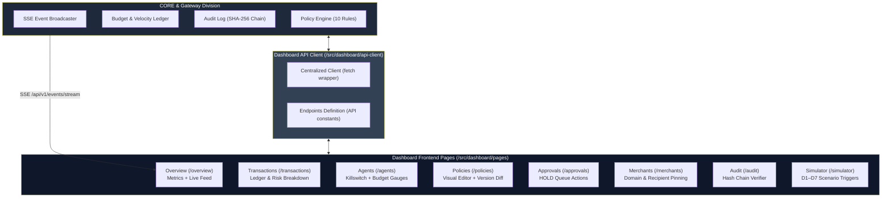
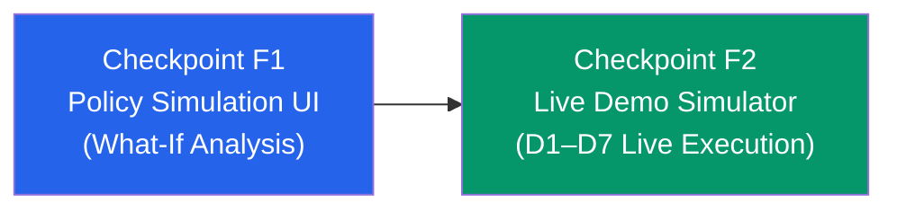

# DASHBOARD — The Autonomous Agent Financial Guard Frontend

> **One-liner:** The control center that makes the Guard visible, interactive, and provable — turning invisible 60ms micro-decisions and zero-gas interceptions into real-time metrics, live cryptographic audit trails, and one-click demo controls for judges and operators.

This document explains everything inside `src/dashboard/` in detail. It connects every frontend screen and component directly to the **CORE** policy engine (`src/core/PITCH.md`) and the **DEMO** lane (`src/demo/pitch.md`).

---

## 1. What the Frontend Does

If CORE is the brain and PAY is the hands, the Dashboard is the **cockpit and black box**:

| # | Pillar | Description | Core / Demo Connection |
|---|---|---|---|
| 1 | **Real-Time Visibility** | Live SSE event stream showing autonomous payments being evaluated in sub-millisecond time. | `GET /api/v1/events/stream` + `GET /api/v1/metrics/summary` |
| 2 | **Zero-Gas Proof** | Highlighting blocked spend ($2,009.58 blocked with 0 on-chain gas transactions). | Core metrics + D6 prompt injection containment |
| 3 | **Policy Control** | Visual and JSON editor for 10 blocking rules, risk review bands, and version diffing. | `POST /api/v1/policies`, `GET /api/v1/policies/:id/versions` |
| 4 | **Human-in-the-Loop** | Approval inbox for transactions landing in the HOLD review zone ($0.10–$1.00 or risk score ≥ 30). | `GET /api/v1/approvals`, `POST /api/v1/approvals/:id/approve` |
| 5 | **Emergency Killswitch** | One-click instant freeze for runaway or compromised agents. | `POST /api/v1/agents/:id/freeze` |
| 6 | **Cryptographic Trust** | Visual verification of SHA-256 append-only tamper-evident hash chains. | `GET /api/v1/audit/verify` |
| 7 | **Interactive Simulator** | One-click triggers for demo scenarios D1–D7 proving defense against live attacks. | `src/demo/simulator/` + `/simulator` |

---

## 2. System Architecture: How the Dashboard Fits In



---

## 3. Detailed Page-by-Page Feature Mapping

### 1. Enforcement Overview (`/overview` & `/`)
* **File:** [`src/dashboard/pages/overview.tsx`](file:///d:/DOWNLOAD%202/x402Project/src/dashboard/pages/overview.tsx)
* **Backing Endpoint:** `GET /api/v1/metrics/summary`, `GET /api/v1/events/stream`
* **What it shows:**
  - **The Hero Metrics:** Total spent USD vs **Blocked USD ($2,009.58)** and **Blocked On-Chain Tx Count (0)**.
  - **Engine Latency:** Displays p95 guard evaluation latency (~0.055 ms).
  - **Decision Distribution:** ALLOW vs HOLD vs BLOCK split.
  - **Top Block Reasons:** Ranked frequency of tripped rules (e.g. `PER_TRANSACTION_LIMIT_EXCEEDED`, `MERCHANT_BLOCKED`).
  - **Live Decision Stream:** Real-time animated feed of incoming payment evaluations via Server-Sent Events.

---

### 2. Autonomous Agents & Killswitch (`/agents` & `/agents/:agentId`)
* **Files:** [`src/dashboard/pages/agents-list.tsx`](file:///d:/DOWNLOAD%202/x402Project/src/dashboard/pages/agents-list.tsx), [`src/dashboard/pages/agent-detail.tsx`](file:///d:/DOWNLOAD%202/x402Project/src/dashboard/pages/agent-detail.tsx), [`src/dashboard/components/agent-card.tsx`](file:///d:/DOWNLOAD%202/x402Project/src/dashboard/components/agent-card.tsx)
* **Backing Endpoints:** `GET /api/v1/agents`, `GET /api/v1/agents/:id`, `POST /api/v1/agents/:id/freeze`, `GET /api/v1/budgets/:agentId`
* **What it shows:**
  - **Spender Roster:** Active agents (e.g., `agent_researchbot`, `agent_databot`) and wallet addresses.
  - **Instant Killswitch (Freeze / Unfreeze):** One-click button that immediately enforces Rule 1 (`AGENT_FROZEN`) on the very next payment attempt.
  - **Multi-Window Budget Gauges:** Circular/linear progress meters for Hourly, Daily, and Monthly budgets.
  - **Velocity Meters:** Current transaction rate vs limits (`tx/min` and `tx/hour`).
  - **Wallet Allowance Pool:** Tracks remaining funded wallet balance.

---

### 3. Policy Engine Editor & Version Diff (`/policies` & `/policies/:agentId`)
* **Files:** [`src/dashboard/pages/policy-editor.tsx`](file:///d:/DOWNLOAD%202/x402Project/src/dashboard/pages/policy-editor.tsx), [`src/dashboard/components/policy-form.tsx`](file:///d:/DOWNLOAD%202/x402Project/src/dashboard/components/policy-form.tsx)
* **Backing Endpoints:** `GET /api/v1/policies/:agentId`, `POST /api/v1/policies`, `GET /api/v1/policies/:agentId/versions`
* **What it shows:**
  - **Visual Form Editor:** Configure all financial rules:
    - Max per-transaction limit ($0.10)
    - Hourly, Daily, Monthly budget caps
    - Allowed networks (Base Sepolia) & assets (USDC)
    - Velocity ceilings (e.g., 10 tx/min)
    - Risk review dollar bands ($0.10 – $1.00)
    - Risk score thresholds (Hold ≥ 30, Block ≥ 60)
  - **JSON Schema View:** Direct inspection of the raw declarative policy object.
  - **Version Diffing:** Side-by-side comparison between historical versions and current active version (`v3`), tracking parameter changes across updates.

---

### 4. Approvals Inbox — HOLD Queue (`/approvals`)
* **Files:** [`src/dashboard/pages/approvals.tsx`](file:///d:/DOWNLOAD%202/x402Project/src/dashboard/pages/approvals.tsx), [`src/dashboard/components/approval-card.tsx`](file:///d:/DOWNLOAD%202/x402Project/src/dashboard/components/approval-card.tsx)
* **Backing Endpoints:** `GET /api/v1/approvals`, `POST /api/v1/approvals/:id/approve`, `POST /api/v1/approvals/:id/reject`
* **What it shows:**
  - **Human Review Zone:** Payments flagged for human sign-off (e.g., $0.45 transaction in the $0.10–$1.00 review window or elevated risk score).
  - **Interactive Action Buttons:** Single-click **Approve** (commits budget and allows settlement) or **Reject** (releases reservation and cancels payment).
  - **Contextual Signals:** Explains why the transaction was held (e.g. unknown merchant, review band).

---

### 5. Transactions Ledger & Decision Timeline (`/transactions` & `/transactions/:intentId`)
* **Files:** [`src/dashboard/pages/transactions.tsx`](file:///d:/DOWNLOAD%202/x402Project/src/dashboard/pages/transactions.tsx), [`src/dashboard/pages/transaction-detail.tsx`](file:///d:/DOWNLOAD%202/x402Project/src/dashboard/pages/transaction-detail.tsx), [`src/dashboard/components/tx-table.tsx`](file:///d:/DOWNLOAD%202/x402Project/src/dashboard/components/tx-table.tsx), [`src/dashboard/components/tx-timeline.tsx`](file:///d:/DOWNLOAD%202/x402Project/src/dashboard/components/tx-timeline.tsx)
* **Backing Endpoints:** `GET /api/v1/transactions`, `GET /api/v1/transactions/:id`
* **What it shows:**
  - **Searchable Ledger:** Complete record of all payment intents with status badges (`ALLOW`, `HOLD`, `BLOCK`).
  - **Decision Breakdown:** The exact rule that triggered the block or allow.
  - **7-Signal Risk Breakdown:** Visual calculation of the risk score (e.g. `unknown_merchant +40, blocked_attempts +25 = 65`).
  - **Ledger Lifecycle:** Displays reservation ID, budget reservation lock status, and on-chain tx hash on BaseScan (for allowed txs) or explicit "Zero on-chain footprint" badge (for blocked txs).

---

### 6. Merchant Directory & Recipient Pinning (`/merchants`)
* **File:** [`src/dashboard/pages/merchants.tsx`](file:///d:/DOWNLOAD%202/x402Project/src/dashboard/pages/merchants.tsx)
* **Backing Endpoint:** `GET /api/v1/merchants`
* **What it shows:**
  - **Allowlisted Services:** Approved API endpoints (e.g. `localhost:3000` sandbox endpoints).
  - **Blocked Domains:** Prohibited domains (e.g. `rogue.example.com`).
  - **Cryptographic PayTo Pinning:** Shows the exact pinned recipient wallet address for each merchant, proving protection against wallet swapping (Rule 5 `RECIPIENT_MISMATCH`).

---

### 7. Cryptographic Audit Trail (`/audit`)
* **File:** [`src/dashboard/pages/audit.tsx`](file:///d:/DOWNLOAD%202/x402Project/src/dashboard/pages/audit.tsx)
* **Backing Endpoints:** `GET /api/v1/audit`, `GET /api/v1/audit/verify`
* **What it shows:**
  - **Verification Banner:** Green "100% Valid" badge verifying that all audit entries match `sha256(prevHash + rowPayload)` with no tampering.
  - **Hash Chain Inspector:** Displays sequence number (`Seq #`), `rowHash`, and `prevHash` for every audit log entry.
  - **Pre-Settlement Guarantee:** Visual verification that audit rows were committed *prior* to payment signing.

---

### 8. Interactive Demo Simulator (`/simulator`)
* **File:** [`src/dashboard/pages/simulator.tsx`](file:///d:/DOWNLOAD%202/x402Project/src/dashboard/pages/simulator.tsx)
* **Backing Endpoint:** `POST /api/v1/simulator/run`
* **What it shows:**
  - **One-Click Scenarios (D1–D7):**
    - **D1:** Normal Allowed Payment ($0.02 search API → ALLOW)
    - **D2:** Per-Transaction Limit Exceeded ($2.00 report → BLOCK)
    - **D3:** Velocity Burst (11 rapid payments → VELOCITY_EXCEEDED)
    - **D4:** Rogue Merchant / Swapped Wallet → BLOCK
    - **D5:** Hourly Budget Exhaustion → BUDGET_EXCEEDED
    - **D6:** Review Band Approval ($0.45 → HOLD in approval inbox)
    - **D7:** Prompt Injection Attack ($2,000 extraction attempt → ABSOLUTE_BLOCK_THRESHOLD)
  - **Instant Visual Feedback:** Shows expected vs actual decision and execution result.

---

## 4. Summary Table: Core & Demo Rules to Frontend Component

| Core / Demo Rule | Failure Code | Primary UI Screen | Key UI Component |
|---|---|---|---|
| **Rule 1: Agent Active** | `AGENT_FROZEN` | `/agents`, `/agents/:id` | `AgentCard`, Killswitch toggle |
| **Rule 2: Allowed Rails** | `NETWORK_NOT_ALLOWED` / `ASSET_NOT_ALLOWED` | `/policies` | `PolicyForm` rail selector |
| **Rule 3: Merchant Blocklist** | `MERCHANT_BLOCKED` | `/merchants`, `/overview` | `MerchantsPage`, `ReasonChip` |
| **Rule 4: Merchant Allowlist** | `MERCHANT_NOT_ALLOWLISTED` | `/merchants`, `/policies` | `MerchantsPage`, `PolicyForm` |
| **Rule 5: Recipient Pinning** | `RECIPIENT_MISMATCH` | `/merchants`, `/transactions/:id` | Pinned wallet badge, `TxTimeline` |
| **Rule 6: Per-Tx Limit** | `PER_TRANSACTION_LIMIT_EXCEEDED` | `/policies`, `/overview` | `PolicyForm`, Hero metrics |
| **Rule 7: Absolute Ceiling** | `ABSOLUTE_BLOCK_THRESHOLD` | `/policies`, `/simulator` | `PolicyForm`, D7 prompt injection card |
| **Rule 8: Budget Windows** | `BUDGET_EXCEEDED` | `/agents/:id` | `BudgetGauge` (Hour, Day, Month) |
| **Rule 9: Velocity Limits** | `VELOCITY_EXCEEDED` | `/agents/:id` | `VelocityMeter` (tx/min gauge) |
| **Rule 10: Wallet Allowance** | `ALLOWANCE_EXHAUSTED` | `/agents`, `/agents/:id` | Allowance pool summary card |
| **Risk Scoring (7 signals)** | `RISK_TOO_HIGH` | `/transactions/:id` | Risk breakdown list & meter |
| **HOLD Review Band** | `APPROVAL_REQUIRED` | `/approvals` | `ApprovalCard` (Approve / Reject) |
| **Audit Hash Chain** | Tamper detection | `/audit` | Audit chain verification banner |
| **Zero-Gas Demonstration** | $2,009 blocked / 0 gas | `/overview` | Hero metric cards |

---

## 5. Detailed Implementation Plan for Missing Frontend Features

This section lays out the concrete, step-by-step implementation plan for the two remaining frontend features under Checkpoints **F1** and **F2**.



---

### Checkpoint F1: Policy Simulation Interface ("What-If" Historical Replay)

> **Objective:** Give operators a safe "What-If" sandbox inside the Policy Editor to replay historical payment intents against draft rules *before* saving an immutable policy version.

#### 1. Backend Contract (`POST /api/v1/policies/:agentId/simulate`)
* **File:** [`src/core/handlers/policy-simulate.ts`](file:///d:/DOWNLOAD%202/x402Project/src/core/handlers/policy-simulate.ts)
* **Request Payload:**
  ```json
  {
    "rules": { /* PolicyRules object currently edited in form */ },
    "limit": 50
  }
  ```
* **Response Payload:**
  ```json
  {
    "status": true,
    "statusCode": 200,
    "data": {
      "simulated": 40,
      "changedCount": 4,
      "newlyAllowed": 1,
      "newlyBlocked": 3,
      "results": [
        {
          "intentId": "01JM8...",
          "amountUsd": "2.00",
          "merchant": "localhost:3000",
          "was": "ALLOW",
          "wouldBe": "BLOCK",
          "changed": true,
          "reasons": ["PER_TRANSACTION_LIMIT_EXCEEDED"]
        }
      ]
    }
  }
  ```

#### 2. Frontend Implementation Steps
1. **API Client Registration:**
   - Update [`src/dashboard/api-client/endpoints.ts`](file:///d:/DOWNLOAD%202/x402Project/src/dashboard/api-client/endpoints.ts) to add `policySimulate: (agentId: string) => /api/v1/policies/${agentId}/simulate`.
2. **Policy Editor Tab & Trigger:**
   - Update [`src/dashboard/pages/policy-editor.tsx`](file:///d:/DOWNLOAD%202/x402Project/src/dashboard/pages/policy-editor.tsx) to add a 4th top tab: **"Simulate Impact (What-If)"**.
   - Add a primary CTA button: `"Run Replay Simulation"`.
3. **Simulation Results Component (`src/dashboard/components/policy-simulation-results.tsx`):**
   - **Delta Summary Banner:** Displays `Simulated: X`, `Decision Changes: Y`, with a warning banner for `Newly Allowed` (loosened security risk) vs `Newly Blocked`.
   - **Interactive Diff Table:** Lists each replayed transaction, showing:
     - Intent ID & Merchant
     - Amount ($USD)
     - Previous Decision (`was`) vs Simulated Decision (`wouldBe`)
     - Decision Delta Chip (`ALLOW → BLOCK` or `BLOCK → ALLOW`)
     - Exact Rule Reasons that fired under the draft rules.

#### 3. Acceptance Criteria for F1
- [ ] Clicking "Run Replay Simulation" sends current draft rules to `POST /api/v1/policies/:agentId/simulate`.
- [ ] If changing max transaction limit from $0.10 to $0.05, transactions between $0.05 and $0.10 clearly show as `newlyBlocked`.
- [ ] No DB writes or policy mutations occur during simulation.

---

### Checkpoint F2: Live Interactive Simulator Hookup (`/simulator` D1–D7 Live Execution)

> **Objective:** Connect the visual simulator page to the real live backend execution harness (`POST /api/v1/simulator/run`), streaming exact execution logs, BaseScan links, and zero-gas proof directly to judges in real time.

#### 1. Backend Contract (`POST /api/v1/simulator/run`)
* **File:** [`src/demo/handlers/simulator-run.ts`](file:///d:/DOWNLOAD%202/x402Project/src/demo/handlers/simulator-run.ts)
* **Request Payload:**
  ```json
  { "scenario": "D1" }
  ```
* **Response Payload:**
  ```json
  {
    "status": true,
    "statusCode": 200,
    "data": {
      "scenario": "D1_NORMAL",
      "passed": true,
      "transcript": [
        "[D1] Intent generated: $0.02 to localhost:3000/api/sandbox/search",
        "[D1] Guard evaluated: ALLOW (reservation res_01JM...)",
        "[D1] Settled on Base Sepolia: tx 0x4f8a... (0.055ms guard latency)",
        "[D1] PASS: payment settled within policy"
      ]
    }
  }
  ```

#### 2. Frontend Implementation Steps
1. **Live API Call in Simulator Page:**
   - Update [`src/dashboard/pages/simulator.tsx`](file:///d:/DOWNLOAD%202/x402Project/src/dashboard/pages/simulator.tsx) `handleRun(scenario)` to call `apiPost<SimulatorRunResponse>(API.simulatorRun, { scenario: s.id })`.
2. **Terminal / Transcript Drawer Component:**
   - Add an expandable dark terminal viewer below each scenario card (or a bottom live log console).
   - Render step-by-step colored log lines from `transcript[]`:
     - Green for `ALLOW` and `PASS`
     - Red/Amber for `BLOCK`, `HOLD`, and intercepted attack attempts
     - Blue font for BaseScan transaction links
3. **Real-Time State Indicators:**
   - Add spinner state on the active running scenario button.
   - Add "Copy Transcript" button so operators can paste output into reports or judge chat.

#### 3. Acceptance Criteria for F2
- [ ] Running Scenario D1 triggers real payment evaluation, outputs genuine execution logs, and shows PASS.
- [ ] Running Scenario D6 / D7 proves prompt injection interception: displays 1,000 attempts blocked, $2,000 saved, and $0.02 settled.
- [ ] Errors or offline dependencies display clear informative diagnostics rather than crashing the page.

---

## 6. Running the Frontend

```bash
# 1. Start local Next.js development server
npm run dev

# 2. Open dashboard in browser
# http://localhost:3000/overview
```
