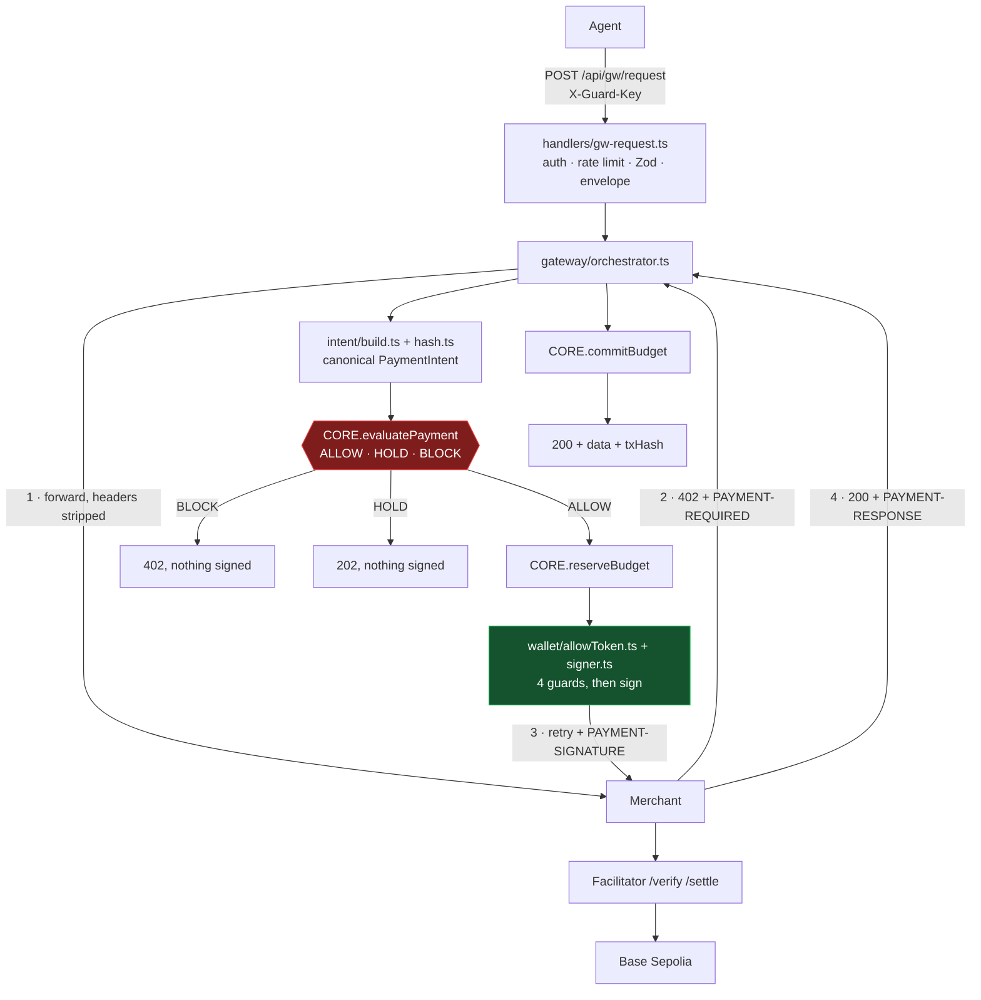

# 🟥 PAY — progress log

[BUILD.md](./BUILD.md) is the plan. **This file is the record** — what was actually built, what is
proven, what was decided, and what is still open. Updated at the end of every checkpoint.

**Last updated:** 2026-08-16 · **Branch:** `pay/x402-poc` · **Owner:** PAY (D1 Payments Lead)

| C1 | C2 | C3 | C4 | C5 | C6 | C7 |
|---|---|---|---|---|---|---|
| 🟢 | 🟢 | 🟢 | 🟢 | 🟢 | 🟢 | 🟡 |

**116 tests passing across PAY and DEMO · 0 lint errors · typecheck clean · build clean · 9 real settlements on Base Sepolia**

---

## 1. What this division built



The red box is the product. Everything else exists so a policy decision can sit there, before
anything irreversible happens.

---

## 2. Status board

| C | Checkpoint | Status | Evidence |
|---|---|---|---|
| C1 | Real x402 payment settles | 🟢 green | tx `0x364612…4eda9`, balance $20.00 → $19.99 |
| C2 | Header codecs | 🟢 green | 12 tests against real C1 captures |
| C3 | SDK adapter + facilitator types | 🟢 green | 7 tests + a live settlement through the split |
| C4 | Intent build + hash | 🟢 green | 19 tests · hash moves on all 9 judged terms |
| C5 | allowToken + signer | 🟢 green | 10 tests · 3 mutation runs · live attack paths refused |
| C6 | Gateway orchestrator | 🟢 green | 34 tests · release proven on 6 failure paths |
| C7 | `POST /api/gw/request` | 🟡 half | endpoint live and settling; engine swap waits on CORE |

Legend: 🟢 green · 🟡 partly done · ⚪ not started · 🔴 blocked

---

## 3. Test inventory

| File | Tests | Covers |
|---|---|---|
| `tests/headers.test.ts` | 12 | codecs, malformed input, dollars-vs-minor-units, settlement failure |
| `tests/adapter.test.ts` | 7 | the read/sign/read split, offline EIP-3009 signing, offer narrowing |
| `tests/intent.test.ts` | 19 | field mapping, minor units, hash sensitivity per term, key-order independence |
| `tests/signer.test.ts` | 10 | tamper, replay, expiry, wrong-intent token, wrong merchant |
| `tests/forward.test.ts` | 19 | header stripping by prefix, signature injection |
| `tests/orchestrator.test.ts` | 15 | happy path, BLOCK/HOLD, 6 failure paths releasing the reservation |
| `tests/gw-request.test.ts` | 12 | the frozen contract, auth, SSRF, 429, secret leakage |
| `tests/fixtures.ts` | — | pinned real captures shared by the suite |
| **Total** | **94** | plus 6 from `core/tests/money` and 16 from DEMO = **116** suite-wide |

### Mutation testing

Passing tests prove nothing if they would also pass with the protection removed. Each guard was
deleted in turn and the suite re-run:

| Guard removed | Tests killed |
|---|---|
| `verifyAllowToken` call | 4 |
| signer's term-by-term offer match | 3 |
| signer's intentHash integrity check | 1 |
| orchestrator's `releaseBudget` call | 6 |

---

## 4. On-chain evidence

Every settlement below is a real transaction on Base Sepolia, paid in test USDC from
`0x0D3CaC5f27705C4c72185B8B74A543F3530F84ef`.

| # | Checkpoint | txHash | What it proved |
|---|---|---|---|
| 1 | C1 | `0x164317…3c2b` | the SDK settles at all (paid the agent's own address) |
| 2 | C1 | `0x364612…4eda9` | payer and payee distinct, $20.00 → $19.99 |
| 3 | C3 | `0x9e060e…8f15` | the manual read/sign/retry split is accepted by the facilitator |
| 4 | C3 | `0x939b5b…1092` | the split again, with no env override |
| 5 | C5 | `0x7c54c3…7191` | a signature produced by `wallet/signer.ts` settles |
| 6 | C6 | `0xa9f002…bec2` | the full orchestrator, with smuggled headers stripped |
| 7 | C7 | `0x5ff0eb…13c4` | the public HTTP endpoint, end to end |
| 8 | integration | `0xad75f6…a5ad` | the gateway against DEMO's real seller, $0.02 |
| 9 | integration | `0x078724…60cd` | `poc:x402` retargeted to `/api/sandbox/search` |

Balance: **$20.00 → $19.91**. Gas on every one was paid by the facilitator's signer
`0xd407e4…f1bf`, never by the agent — the agent wallet has held **0 ETH** throughout.

---

## 5. Checkpoint detail

### C1 — prove x402 works

**Files.** `scripts/fund-wallet.ts`, `scripts/poc-x402.ts`

x402 was the only dependency the team does not control, so it was proven before any product code.

| Finding | Detail |
|---|---|
| Package line | The scoped `@x402/fetch` `@x402/evm` `@x402/next` at **2.22.0** is protocol v2. The unscoped `x402-fetch@1.2.0` is the old line |
| Network id | The wire says `eip155:84532`, **not** `base-sepolia` — raised as B3 |
| Header names | v2 really does use `PAYMENT-REQUIRED` / `-SIGNATURE` / `-RESPONSE`. `X-PAYMENT` is v1 legacy |
| Gas | `exact` is EIP-3009: the buyer signs, the facilitator broadcasts and pays. The agent needs USDC, not ETH |
| Amount | `"10000"` — integer minor units, never dollars |

DEMO's sandbox was still a stub and the public fallback `x402.org/protected` returned 500, so PAY
stood up a throwaway seller under `app/api/gw/`, a namespace PAY owns. **Deleted 2026-08-16** once
DEMO shipped; `poc:x402` now targets `/api/sandbox/search`.

### C2 — header codecs

**Files.** `x402/headers.ts`, `tests/headers.test.ts`

`@x402/core/http` only regexes the base64 and `JSON.parse`s — **no schema validation**, so a header
encoding `{}` decodes "successfully" to an empty object. `headers.ts` adds the layer the SDK omits.

| Input | Result |
|---|---|
| real capture | decoded, typed |
| not base64 / empty / malformed JSON | `INVALID_PAYMENT_REQUIREMENTS` (422) |
| valid JSON but `{}` or `accepts: []` | `INVALID_PAYMENT_REQUIREMENTS` |
| `amount: "0.01"` — dollars, not minor units | `INVALID_PAYMENT_REQUIREMENTS` |
| settlement `success: false` | `SETTLEMENT_FAILED` (502) |
| `success: true`, unusable tx hash | `SETTLEMENT_FAILED` |

Errors throw `PaymentHeaderError`, carrying an `ERROR_CODES` key so the gateway maps it straight
into `fail()`.

### C3 — SDK adapter

**Files.** `x402/adapter.ts`, `x402/facilitator.ts`, `mock/index.ts`, `tests/adapter.test.ts`

```
readPaymentRequired(response)   ->  the price, decoded
        ^  CORE.evaluatePayment goes HERE  ^
narrowToOffer(required, offer)  ->  binds the SDK to the approved entry
createPaymentSignature(...)     ->  signs, returns the header value
readSettlement(response)        ->  the proven tx hash
```

`wrapFetchWithPayment` does all four in one call and signs before any policy code runs. It is used
in the spike and **must never** appear in the orchestrator.

`narrowToOffer` closes threat T9 at the SDK boundary: `createPaymentPayload` runs its own selector
over `accepts[]`, so a merchant offering two entries could be paid on the one CORE did not approve.

### C4 — intent build and hash

**Files.** `intent/build.ts`, `intent/hash.ts`, `tests/intent.test.ts`

| Intent field | Source |
|---|---|
| `amountMinor` | `BigInt(requirements.amount)` — ⚠️ **not** `toMinor()` |
| `asset` | the contract address, the only unforgeable identifier |
| `network` | `eip155:84532` as it arrives |
| `recipient` | `payTo`, regex-checked |
| `merchant` | `new URL(requestUrl).host`, **with port** |
| `resource` | `` `${METHOD} ${pathname}` ``, query dropped |
| `nonce` | 16 random bytes, fresh per intent |

**The factor-of-10⁶ trap.** BUILD.md specifies `toMinor`. That converts a *dollar* string, so
`toMinor("10000")` returns `10000000000n` — a $10,000 payment where $0.01 was quoted. The wire
already sends minor units. A test pins it.

**The hash covers nine terms**, not the seven the stub listed: `merchant` and `reason` were added.
`merchant` is the exact key CORE's allowlist matches on, so leaving it unbound would permit the very
swap the hash exists to prevent. `intentId` and `createdAt` are excluded and a test asserts they do
not move the hash.

### C5 — allowToken and signer

**Files.** `wallet/allowToken.ts`, `wallet/signer.ts`, `tests/signer.test.ts`

| # | Guard | Stops |
|---|---|---|
| 1 | recompute the hash from the intent's own terms | a term mutated after evaluation |
| 2 | find the offer matching on amount, asset, network, payTo | a similar-but-different offer |
| 3 | offer's `resource.url` host must equal the approved `merchant` | an offer replayed from elsewhere |
| 4 | `verifyAllowToken` — authenticity, expiry, replay, atomically consumed | forged, stale or reused authorisation |

The token is consumed **last** on purpose, so a mismatch in 1–3 never burns a valid one.

`v1.<expiresAtMs>.<evaluationId>.<hmac>`, 60 s TTL. The `intentHash` is never *carried* in the
token, only fed into the MAC — a stolen token discloses nothing and is useless elsewhere. Compared
with `timingSafeEqual`. Verify and consume are one call, so nothing can race between them.

Guard 3 is beyond BUILD.md: without it, a genuine offer from merchant A replayed against merchant B
quoting identical terms would have passed.

### C6 — gateway orchestrator

**Files.** `gateway/forward.ts`, `gateway/orchestrator.ts`, `tests/forward.test.ts`,
`tests/orchestrator.test.ts`

Header stripping is **prefix-based**, not the stub's fixed list. `X-Guard-Anything` would have
sailed through, and `X-PAYMENT` — the v1 name the SDK still accepts — was not listed at all, so an
agent could have smuggled its own payment under the older name.

| Failure path | Reason code |
|---|---|
| merchant 500 on the paid retry | `UPSTREAM_UNAVAILABLE` |
| 402 again on the paid retry | `SETTLEMENT_FAILED` |
| paid 200 with no `PAYMENT-RESPONSE` | `SETTLEMENT_FAILED` |
| facilitator reports `success: false` | `SETTLEMENT_FAILED` |
| timeout | `UPSTREAM_UNAVAILABLE` |
| the signer refuses | the signer's own code |

BLOCK, HOLD and the caller's `maxAmountUsd` all return **before** any reservation, so nothing is
signed and there is nothing to release.

**Bug the live run caught that unit tests missed.** `readPaymentRequired` returns `null` for any
non-402, and the first draft treated `null` as "free resource". A merchant **404 came back as
`SETTLED` / `ALLOW`** — a failed call reported to the agent as a success. Only a 2xx is a free
resource now.

### C7 — `POST /api/gw/request` (half done)

**Files.** `handlers/gw-request.ts`, `handlers/agentAuth.ts`, `tests/gw-request.test.ts`

| Half | State |
|---|---|
| A — the public endpoint | 🟢 live, settling real money over HTTP |
| B — swap `@/core/mock` → `@/core` | ⚪ waits on CORE, plus blocker B7 |

Verified live over HTTP:

| Case | Result |
|---|---|
| no `X-Guard-Key` | `503 GUARD_UNAVAILABLE` |
| unknown key | `503 GUARD_UNAVAILABLE` |
| `http://169.254.169.254/…` | `422`, orchestrator never called |
| `maxAmountUsd: "0.005"` vs a $0.01 quote | `402 PER_TRANSACTION_LIMIT_EXCEEDED`, `txHash: null` |
| valid request | `200` + real txHash `0x5ff0eb…13c4` |
| 58th request in a minute | `429 RATE_LIMITED` — distinct from a policy `402` |

**SSRF boundary.** The agent supplies the URL, so the Guard fetches whatever it is given. The schema
requires `http(s)` and blocks cloud metadata hosts. Private ranges are *not* blocked, because the
demo targets `localhost` — see open question Q1.

**Secret leakage.** A test asserts the serialised response contains no private key, no RPC URL, no
`GUARD_HMAC`, and none of the merchant's own response headers. Only the merchant's **body** is
forwarded.

---

## 6. Open blockers

| id | What | Owner | Blocks |
|---|---|---|---|
| **B7** | 🚨 `src/core/mock` and `src/core` have **different signatures** on all four functions, so C7's promised one-line swap will not compile. Mock: `evaluatePayment()`, `reserveBudget(intentId, amount)`, `commitBudget()`, `releaseBudget()`. Real: `evaluatePayment({intent, idempotencyKey})`, `reserveBudget(agentId, intentId, amount)`, `commitBudget(reservationId, txHash)`, `releaseBudget(reservationId, reason)`. PAY may not edit `src/core/**` | CORE | C7 half B |
| **B3** | Live network id is `eip155:84532`; `src/core/db/seed.ts:33` and `src/core/policy/templates.ts:18` seed `allowedNetworks: ["base-sepolia"]`. Deny-by-default then blocks **every** payment | CORE | C7 half B |
| **B6** | Same shape for assets: seeds say `allowedAssets: ["USDC"]`, the wire carries the contract address `0x036CbD…F7e`. The intent stores the address, because a symbol is merchant-supplied and forgeable while an address is not | CORE | C7 half B |
| **B8** | `EvaluationResult` returns no approval expiry, so the 202 response uses a provisional 15-minute constant | CORE | cosmetic |


| **B5** | The buyer needs test **USDC**, not gas — resolved, documented for whoever funds the next wallet | — | closed |

**B1 closed.** DEMO shipped six sandbox sellers. The throwaway seller and its route are deleted, `poc:x402` now targets `/api/sandbox/search`, and the ESLint SDK exemption is narrowed back to `src/payments/x402/**`.

**B2 closed.** DEMO's `sandbox/middleware.ts` uses the same scoped SDK and the same `eip155:84532`.

**B4 closed.** The header names in the repo docs were investigated and are correct for v2.

### Also owed to CORE

`ALLOW_TOKEN_INVALID` (403) was appended to `src/shared/errors.ts`, following that file's own
append-only rule, because CLAUDE.md requires error codes come from the catalogue. CORE owns the file
and should be told.

---

## 7. Decisions

| Decision | Why |
|---|---|
| Throwaway seller at `app/api/gw/poc-seller/` | `app/api/gw/**` is PAY-owned; `app/api/sandbox/*` is DEMO's |
| `poc-seller.ts` exempt from the `@x402/*` ESLint ban | sellers use `@x402/next`, which the buyer-side adapter does not wrap |
| `poc-x402.ts` rewrites `Docs/x402-notes.md` on every run | C2's tests need byte-exact captures; hand-copying base64 is where that breaks |
| Test fixtures pinned, not read from the notes file | the notes file is overwritten each run; tests must not drift with it |
| Seller builds its handler on first request | reading env at module load breaks `next build` |
| `wrapFetchWithPayment` in the spike only | in the orchestrator it would sign before the policy engine runs |
| The SDK boundary is the `x402/` **folder**, not `adapter.ts` alone | `headers.ts` is SDK surface too; making it import from `adapter.ts` would invert the layering |
| Adapter takes a `Response` rather than fetching | `gateway/forward.ts` owns proxying; two request paths would duplicate the stripping rules |
| `SignInput` carries the `PaymentRequired` envelope | the SDK needs it to build a payload, and searching `accepts[]` *is* the field-by-field re-check |
| Auth and rate limit fall back only under `USE_MOCKS=1` | keeps DEMO unblocked without shipping an auth bypass; production fails closed |
| Only the merchant's **body** is returned to the agent | its headers could carry `set-cookie` or internal metadata |

---

## 8. Known ceilings

| Ceiling | Impact | Upgrade path |
|---|---|---|
| Spent allowTokens live in an in-process `Map` | replay protection is single-instance; on multiple lambdas a replay could land on a cold one | `used_allow_tokens` row under a unique constraint, so Postgres decides the race |
| Rate-limit counters are in-process | limits are per-instance | CORE's real limiter |

Both are marked with `ponytail:` comments at the code site.

---

## 9. Remaining PAY work

| # | Item | Blocked by | Size |
|---|---|---|---|
| 1 | `wallet/balance.ts` — the only stub left in the division. Feeds `EvaluationContext.walletAllowanceRemainingMinor` (policy rule 10). The RPC reads already exist in `fund-wallet.ts` | nobody | ~15 min |
| 2 | C7 half B — the engine swap, plus the four call sites B7 forces | CORE | ~10 min |

| 4 | P6 — production deploy to Vercel | C7 | ~30 min |
| 5 | Move the allowToken replay store to Postgres | CORE's schema | optional |

### Non-code

- `.env.local` still has `MERCHANT_WALLET_ADDRESS` set to the agent's **own** address. Live runs
  looked correct only because the dev server was started with an override. Set it to a second
  address, or DEMO's.
- BaseScan screenshot for PPT slide 4.
- Send CORE: B3, B6, B7, B8 and the `ALLOW_TOKEN_INVALID` code.

### Open question

**Q1 — SSRF.** The agent chooses the URL and the Guard fetches it *before* the merchant allowlist is
consulted, because the price is not known until the 402 arrives. Cloud metadata hosts are blocked
and non-http schemes are rejected, but private ranges are not, since the demo targets `localhost`.
Worth deciding as a team whether the merchant allowlist should also be checked pre-forward.

---

## 10. How to run it

```bash
npm install
npm run wallet:fund            # prints a key when none is set, else address + balances
npm run dev                    # terminal 1 — hosts the throwaway seller
npm run poc:x402               # terminal 2 — end to end, writes Docs/x402-notes.md
```

The full endpoint, with `USE_MOCKS=1` so the demo key is accepted:

```bash
curl -s -X POST localhost:3000/api/gw/request \
  -H "X-Guard-Key: gk_live_researchbot_demo" -H "Content-Type: application/json" \
  -d '{"url":"http://localhost:3000/api/gw/poc-seller","method":"POST","body":{"query":"x402"},"reason":"demo"}'
```

```bash
npm test                       # 100 tests
npm run typecheck
npm run lint                   # the SDK boundary is enforced here
npm run build
```

⚠️ If port 3000 is taken, `next dev` falls back to 3001 and `NEXT_PUBLIC_APP_URL` must match, or the
buyer shops at the wrong store. `poc:x402` names this in its error message.
